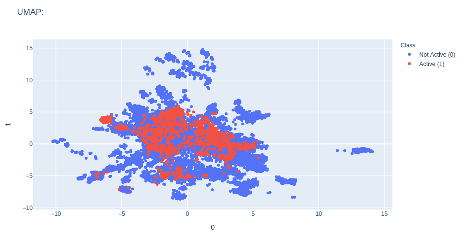
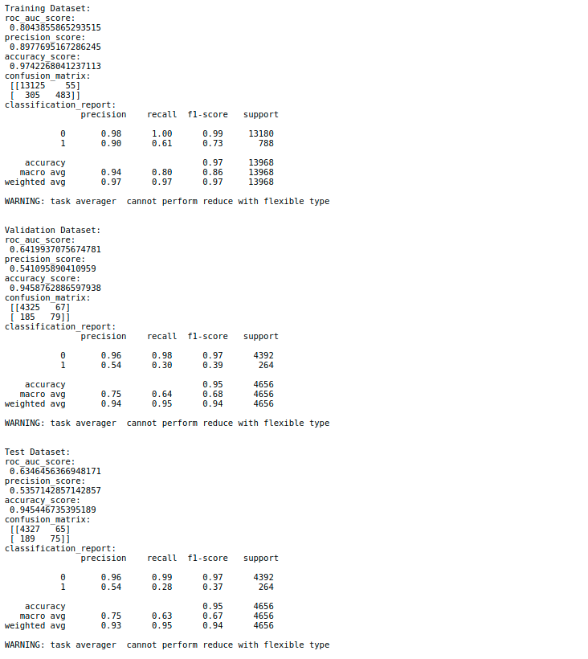
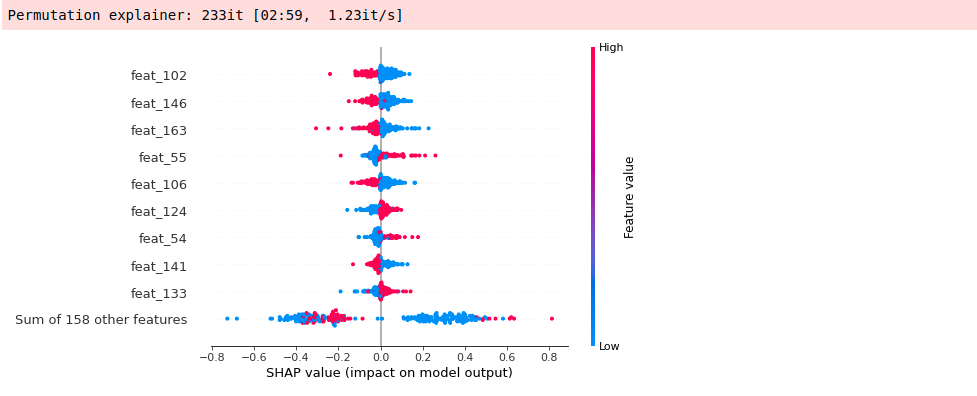
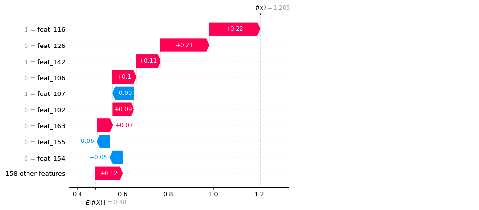
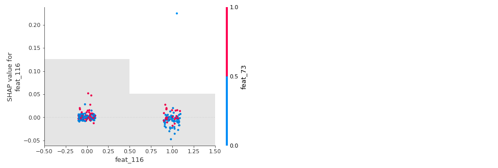
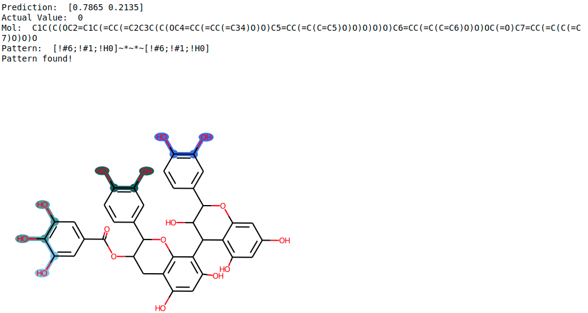

# DeepMol

### Description
DeepMol is a Python-based machine and deep learning framework for drug discovery. 
It offers a variety of functionalities that enable a smoother approach to many 
drug discovery and chemoinformatics problems. It uses Tensorflow, Keras, 
Scikit-learn and DeepChem to build custom ML and DL models or 
make use of pre-built ones. It uses the RDKit framework to perform 
operations on molecular data.

More detailed and comprehensive documentation in [DeepMol readthedocs](https://deepmol.readthedocs.io/en/latest/).

### Google colabs to run AutoML

- [Binary and multiclass classification](https://colab.research.google.com/drive/1wtiwuuhfWKVo40ywgweWUMavKL0zdwJK?usp=sharing)
- [Regression](https://colab.research.google.com/drive/1vE-Q01orImdD4qFTo20MAT4E4kP2hsYF?usp=sharing)
- [Multi-task/multi-label](https://colab.research.google.com/drive/18z2vN6zLNSVJ3qgskKZTYxA_t9UNS1b8?usp=sharing)

### Table of contents:

- [Installation](#installation)
    - [Pip](#pip)
    - [Manually](#manually)
    - [Docker](#docker)
    - [Disclaimer](#disclaimer)
- [Getting Started](#getting-started)
    - [Load dataset from csv](#load-a-dataset-from-a-csv)
    - [Load dataset from sdf](#load-a-dataset-from-a-sdf)
    - [Compound Standardization](#compound-standardization)
    - [Compound Featurization](#compound-featurization)
    - [Feature Selection](#feature-selection)
    - [Unsupervised Exploration](#unsupervised-exploration)
    - [Data Split](#data-split)
    - [Build, train and evaluate a model](#build-train-and-evaluate-a-model)
    - [Hyperparameter Optimization](#hyperparameter-optimization)
    - [Feature Importance (Shap Values)](#feature-importance-shap-values)
    - [Unbalanced Datasets](#unbalanced-datasets)
    - [Pipelines](#pipeline)
    - [Pipeline Optimization](#pipeline-optimization)
- [About Us](#about-us)
- [Citing DeepMol](#citing-deepmol)
  - [Related Publications](#publications-using-deepmol)
- [License](#licensing)


## Installation

### Pip

Install DeepMol via pip:

If you intend to install all the deepmol modules' dependencies:

```bash
pip install deepmol[all]
```

or in MacOS:

```bash
pip install "deepmol[all]"
```


Extra modules:

```bash
pip install deepmol[preprocessing]
pip install deepmol[machine-learning]
pip install deepmol[deep-learning]
```

or in MacOS:

```bash
pip install "deepmol[preprocessing]"
pip install "deepmol[machine-learning]"
pip install "deepmol[deep-learning]"
```

Also, you should install mol2vec and its dependencies:

```bash
pip install git+https://github.com/samoturk/mol2vec#egg=mol2vec
```

### Manually


Alternatively, clone the repository and install the dependencies manually:

1. Clone the repository:
```bash
git clone https://github.com/BioSystemsUM/DeepMol.git
```

3. Install dependencies:
```bash
python setup.py install
```

### Docker

You can also use the provided image to build your own Docker image:

```bash
docker pull biosystemsum/deepmol
```

### Disclaimer

If you’d like to use the GPU, make sure to install the versions of TensorFlow and DGL that match the CUDA drivers for your hardware.

Do not install JAX, it will result dependency conflicts. 

Loading tensorflow models will be problematic for MacOS users due to a known tensorflow issue [46](https://github.com/keras-team/tf-keras/issues/46).


## Getting Started

DeepMol is built in a modular way allowing the use of its methods for 
multiple tasks. It offers a complete workflow to perform ML and DL tasks 
using molecules represented as SMILES. It has modules that perform 
standard tasks such as the loading and standardization of the data, computing 
molecular features like molecular fingerprints, performing feature selection 
and data splitting. It also provides  methods to deal with unbalanced datasets, 
do unsupervised exploration of the data and compute feature importance as 
shap values.


### Load a dataset from a CSV

To load data from a CSV it's only required to provide the math and molecules 
field name. Optionally, it is also possible to provide a field with some ids, 
the labels fields, features fields, features to keep (useful for instance 
to select only the features kept after feature selection) and the number of 
samples to load (by default loads the entire dataset).

```python
from deepmol.loaders.loaders import CSVLoader

# load a dataset from a CSV (required fields: dataset_path and smiles_field)
loader = CSVLoader(dataset_path='../../data/train_dataset.csv',
                   smiles_field='mols',
                   id_field='ids',
                   labels_fields=['y'],
                   features_fields=['feat_1', 'feat_2', 'feat_3', 'feat_4'],
                   shard_size=1000,
                   mode='auto')

dataset = loader.create_dataset()

# print the shape of the dataset (molecules, X, y)
dataset.get_shape()

((1000,), None, (1000,))
```

### Load a dataset from an SDF

If you want to load a dataset from an SDF file with 3D structures, it is only required to provide
the path to the file. Optionally, it is also possible to provide a field with some ids,
the labels fields.

```python
from deepmol.loaders import SDFLoader

# load a dataset from a SDF (required fields: dataset_path)
loader = SDFLoader(dataset_path='../../data/train_dataset.sdf',
                   id_field='ids',
                   labels_fields=['y'],
                   shard_size=1000,
                   mode='auto')
dataset = loader.create_dataset()
dataset.get_shape()

((1000,), None, (1000,))
```

### Compound Standardization

It is possible to standardize the loaded molecules using three options. Using
a basic standardizer that only does sanitization (Kekulize, check valencies, 
set aromaticity, conjugation and hybridization). A more complex standardizer can
be customized by choosing or not to perform specific tasks such as sanitization, 
removing isotope information, neutralizing charges, removing stereochemistry and removing
smaller fragments. Another possibility is to use the ChEMBL Standardizer.

```python
from deepmol.standardizer import BasicStandardizer, CustomStandardizer, ChEMBLStandardizer 

# Option 1: Basic Standardizer
standardizer = BasicStandardizer().standardize(dataset)

# Option 2: Custom Standardizer
heavy_standardisation = {
    'REMOVE_ISOTOPE': True,
    'NEUTRALISE_CHARGE': True,
    'REMOVE_STEREO': True,
    'KEEP_BIGGEST': True,
    'ADD_HYDROGEN': True,
    'KEKULIZE': False,
    'NEUTRALISE_CHARGE_LATE': True}
standardizer2 = CustomStandardizer(heavy_standardisation).standardize(dataset)

# Option 3: ChEMBL Standardizer
standardizer3 = ChEMBLStandardizer().standardize(dataset)
```
### Compound Featurization

It is possible to compute multiple types of molecular fingerprints like Morgan
Fingerprints, MACCS Keys, Layered Fingerprints, RDK Fingerprints and AtomPair 
Fingerprints. Featurizers from DeepChem and molecular embeddings like the 
Mol2Vec can also be computed. More complex molecular embeddings like the 
Seq2Seq and transformer-based are in  development and will be added soon.

```python
from deepmol.compound_featurization import MorganFingerprint

# Compute morgan fingerprints for molecules in the previously loaded dataset
MorganFingerprint(radius=2, size=1024).featurize(dataset, inplace=True)
# view the computed features (dataset.X)
dataset.X
```


```python
#print shape of the dataset to see the difference in the X shape
dataset.get_shape()

((1000,), (1000, 1024), (1000,))
```


### Feature Selection

Regarding feature selection it is possible to do Low Variance Feature Selection, 
KBest, Percentile, Recursive Feature Elimination and selecting features based on 
importance weights.

```python
from deepmol.feature_selection import LowVarianceFS

# Feature Selection to remove features with low variance across molecules
LowVarianceFS(0.15).select_features(dataset, inplace=True)

# print shape of the dataset to see the difference in the X shape (fewer features)
dataset.get_shape()

((1000,), (1000, 35), (1000,))
```

### Unsupervised Exploration

It is possible to do unsupervised exploration of the datasets using PCA, tSNE,
KMeans and UMAP.

```python
from deepmol.unsupervised import UMAP

ump = UMAP()
umap_df = ump.run(dataset)
ump.plot(umap_df.X, path='umap_output.png')
```



### Data Split

Data can be split randomly or using stratified splitters. K-fold split, train-test
split and train-validation-test split can be used.

```python
from deepmol.splitters.splitters import SingletaskStratifiedSplitter

# Data Split
splitter = SingletaskStratifiedSplitter()
train_dataset, valid_dataset, test_dataset = splitter.train_valid_test_split(dataset=dataset, frac_train=0.7,
                                                                             frac_valid=0.15, frac_test=0.15)
train_dataset.get_shape()

((1628,), (1628, 1024), (1628,))

valid_dataset.get_shape()

((348,), (348, 1024), (348,))

test_dataset.get_shape()

((350,), (350, 1024), (350,))
```

### Build, train and evaluate a model

It is possible to use pre-built models from Scikit-Learn and DeepChem or build new
ones using keras layers. Wrappers for Scikit-Learn, Keras and DeepChem were 
implemented allowing evaluation of the models under a common workspace.

#### Scikit-Learn model example

Models can be imported from scikit-learn and wrapped using the SKlearnModel
module.

Check this **[jupyter notebook](examples/notebooks/featurization.ipynb)** for a complete example!

```python
from sklearn.ensemble import RandomForestClassifier
from deepmol.models.sklearn_models import SklearnModel

# Scikit-Learn Random Forest
rf = RandomForestClassifier()
# wrapper around scikit learn models
model = SklearnModel(model=rf)
# model training
model.fit(train_dataset)

from deepmol.metrics.metrics import Metric
from deepmol.metrics.metrics_functions import roc_auc_score

# cross validate model on the full dataset
best_model, train_score_best_model, test_score_best_model, \
            train_scores, test_scores, average_train_score, average_test_score = model.cross_validate(dataset, Metric(roc_auc_score), folds=3)
```

```python
from sklearn.metrics import precision_score, accuracy_score, confusion_matrix, classification_report

#evaluate the model using different metrics
metrics = [Metric(roc_auc_score), Metric(precision_score), Metric(accuracy_score), Metric(confusion_matrix), 
           Metric(classification_report)]

# evaluate the model on training data
print('Training Dataset: ')
train_score = model.evaluate(train_dataset, metrics)

# evaluate the model on training data
print('Validation Dataset: ')
valid_score = model.evaluate(valid_dataset, metrics)

# evaluate the model on training data
print('Test Dataset: ')
test_score = model.evaluate(test_dataset, metrics)
model.save('my_model')
```



Loading and saving models was never so easy!

```python
model = SklearnModel.load('my_model')
model.evaluate(test_dataset, metrics)
```

#### Keras model example

Example of how to build and wrap a keras model using the KerasModel module.

Check this **[jupyter notebook](examples/notebooks/models.ipynb)** for a complete example!

```python
from tensorflow.keras.models import Sequential
from tensorflow.keras.layers import Dense, Dropout
from deepmol.metrics.metrics import Metric

input_dim = train_dataset.X.shape[1]


def create_model(optimizer='adam', dropout=0.5, input_dim=input_dim):
  # create model
  model = Sequential()
  model.add(Dense(12, input_dim=input_dim, activation='relu'))
  model.add(Dropout(dropout))
  model.add(Dense(8, activation='relu'))
  model.add(Dense(1, activation='sigmoid'))
  # Compile model
  model.compile(loss='binary_crossentropy', optimizer=optimizer, metrics=['accuracy'])
  return model


from deepmol.models.keras_models import KerasModel

model = KerasModel(create_model, epochs=5, verbose=1, optimizer='adam')

# train model
model.fit(train_dataset)

# make prediction on the test dataset with the model
model.predict(test_dataset)

# evaluate model using multiple metrics
metrics = [Metric(roc_auc_score),
           Metric(precision_score),
           Metric(accuracy_score),
           Metric(confusion_matrix),
           Metric(classification_report)]

print('Training set score:', model.evaluate(train_dataset, metrics))
print('Test set score:', model.evaluate(test_dataset, metrics))

model.save('my_model')
```

Loading and saving models was never so easy!

```python
model = KerasModel.load('my_model')
model.evaluate(test_dataset, metrics)
```

#### DeepChem model example

Using DeepChem models:

Check this **[jupyter notebook](examples/notebooks/models.ipynb)** for a complete example!

```python
from deepmol.compound_featurization import WeaveFeat
from deepchem.models import MPNNModel
from deepmol.models.deepchem_models import DeepChemModel
from deepmol.metrics.metrics import Metric
from deepmol.splitters.splitters import SingletaskStratifiedSplitter

ds = WeaveFeat().featurize(dataset)
splitter = SingletaskStratifiedSplitter()
train_dataset, valid_dataset, test_dataset = splitter.train_valid_test_split(dataset=ds, frac_train=0.6, frac_valid=0.2,
                                                                             frac_test=0.2)
mpnn = MPNNModel
model_mpnn = DeepChemModel(mpnn, n_tasks=1, n_pair_feat=14, n_atom_feat=75, n_hidden=75, T=1, M=1, mode='classification')
# Model training
model_mpnn.fit(train_dataset)
valid_preds = model_mpnn.predict(valid_dataset)
test_preds = model_mpnn.predict(test_dataset)
# Evaluation
metrics = [Metric(roc_auc_score), Metric(precision_score), Metric(accuracy_score)]
print('Training Dataset: ')
train_score = model_mpnn.evaluate(train_dataset, metrics)
print('Valid Dataset: ')
valid_score = model_mpnn.evaluate(valid_dataset, metrics)
print('Test Dataset: ')
test_score = model_mpnn.evaluate(test_dataset, metrics)
model_mpnn.save("my_model")
```
Loading and saving models was never so easy!

```python
model = DeepChemModel.load('my_model')
model.evaluate(test_dataset, metrics)
```


### Hyperparameter Optimization

Grid and randomized hyperparameter optimization is provided using cross-validation
or a held-out validation set. For a more detailed example check this 
**[jupyter notebook](examples/notebooks/hyperparameter_optimization.ipynb)**.

```python
from deepmol.parameter_optimization.hyperparameter_optimization import HyperparameterOptimizerValidation

from tensorflow.keras.optimizers import Adam
from tensorflow.keras.layers import Dropout
from tensorflow import keras
from tensorflow.keras import layers

def create_model(input_dim, optimizer='adam', dropout=0.5):
    # create model
    inputs = layers.Input(shape=input_dim)

    # Define the shared layers
    shared_layer_1 = layers.Dense(64, activation="relu")
    dropout_1 = Dropout(dropout)
    shared_layer_2 = layers.Dense(32, activation="relu")

    # Define the shared layers for the inputs
    x = shared_layer_1(inputs)
    x = dropout_1(x)
    x = shared_layer_2(x)

    task_output = layers.Dense(1, activation="sigmoid")(x)

    # Define the model that outputs the predictions for each task
    model = keras.Model(inputs=inputs, outputs=task_output)
    # Compile the model with different loss functions and metrics for each task
    model.compile(
        optimizer=optimizer, loss="binary_crossentropy", metrics=["accuracy"]
    )
    return model

optimizer = HyperparameterOptimizerValidation(create_model,
                                              metric=Metric(accuracy_score),
                                              maximize_metric=True,
                                              n_iter_search=2,
                                              params_dict=params_dict_dense,
                                              model_type="keras")
params_dict_dense = {
                   "input_dim": [train_dataset.X.shape[1]],
                   "dropout": [0.5, 0.6, 0.7],
                   "optimizer": [Adam]
                   }

best_dnn, best_hyperparams, all_results = optimizer.fit(train_dataset=train_dataset,
                                                        valid_dataset=valid_dataset)

# Evaluate model
best_model.evaluate(test_dataset, metrics)
```

### Feature Importance (Shap Values)

Explain the output of a machine learning model can be done using SHAP (SHapley 
Additive exPlanations) package. For a more detailed description you can check out this **[jupyter notebook](examples/notebooks/model_explainability.ipynb)**.
The features that most influenced (positively or
negatively) a certain prediction can be calculated and visualized in different 
ways:

```python
from deepmol.feature_importance import ShapValues

# compute shap values
shap_calc = ShapValues()
shap_calc.fit(train_dataset, model)
shap_calc.beeswarm_plot()
```



```python
shap_calc.sample_explanation_plot(index=1, plot_type='waterfall')
```



```python
shap_calc.feature_explanation_plot(1)
```



#### Draw relevant features

It is possible to plot the ON bits (or some of them) in a molecule for MACCS Keys,
Morgan and RDK Fingeprints. It is also possible to draw those bits on the 
respective molecule. This can be allied with the Shap Values calculation to 
highlight the zone of the molecule that most contributed to a certain prediction,
for instance, the substructure in the molecule that most contributed to its 
classification as an active or inactive molecule against a receptor.

```python
from deepmol.compound_featurization import MACCSkeysFingerprint

patt_number = 54
mol_number = 1

prediction = model.predict(test_dataset)[mol_number]
actual_value = test_dataset.y[mol_number]
print('Prediction: ', prediction)
print('Actual Value: ', actual_value)
smi = test_dataset.mols[mol_number]

maccs_keys = MACCSkeysFingerprint()

maccs_keys.draw_bit(smi, patt_number)
```




### Unbalanced Datasets

Multiple methods to deal with unbalanced datasets can be used to do oversampling,
under-sampling or a mixture of both (Random, SMOTE, SMOTEENN, SMOTETomek and 
ClusterCentroids). For a more detailed example check this **[jupyter notebook](examples/notebooks/imbalanced_learn.ipynb)**.

```python
from deepmol.imbalanced_learn.imbalanced_learn import SMOTEENN

train_dataset = SMOTEENN().sample(train_dataset)
```


### Pipeline

DeepMol provides a pipeline to perform almost all the steps above in a sequence without
having to worry about the details of each step. The pipeline can be used to perform
a prediction pipeline (the last step is a data predictor) or a data transformation pipeline
(all steps are data transformers). Transformers must implement the _fit and _transform
methods and predictors must implement the _fit and _predict methods.

```python
from deepmol.loaders import CSVLoader
from tensorflow.keras import Sequential
from tensorflow.keras.layers import Dense
from deepmol.models import KerasModel
from deepmol.standardizer import BasicStandardizer
from deepmol.compound_featurization import MorganFingerprint
from deepmol.scalers import StandardScaler
from deepmol.feature_selection import KbestFS
from deepmol.pipeline import Pipeline
from deepmol.metrics import Metric
from sklearn.metrics import accuracy_score

loader_train = CSVLoader('data_train_path.csv',
                         smiles_field='Smiles',
                         labels_fields=['Class'])
train_dataset = loader_train.create_dataset(sep=";")

loader_test = CSVLoader('data_test_path.csv',
                        smiles_field='Smiles',
                        labels_fields=['Class'])
test_dataset = loader_train.create_dataset(sep=";")
        
def basic_classification_model_builder(input_shape):
  model = Sequential()
  model.add(Dense(10, input_shape=input_shape, activation='relu'))
  model.add(Dense(1, activation='sigmoid'))
  model.compile(loss='binary_crossentropy', optimizer='adam', metrics=['accuracy'])
  return model

keras_model = KerasModel(model_builder=basic_classification_model_builder, epochs=2, input_shape=(1024,))
        
steps = [('standardizer', BasicStandardizer()),
         ('featurizer', MorganFingerprint(size=1024)),
         ('scaler', StandardScaler()),
         ('feature_selector', KbestFS(k=10)),
         ('model', keras_model)]

pipeline = Pipeline(steps=steps, path='test_pipeline/')

pipeline.fit_transform(train_dataset)

predictions = pipeline.predict(test_dataset)
pipeline.evaluate(test_dataset, [Metric(accuracy_score)])

# save pipeline
pipeline.save()

# load pipeline
pipeline = Pipeline.load('test_pipeline/')
``` 

### Pipeline optimization
```python
from sklearn.ensemble import RandomForestClassifier
from sklearn.metrics import accuracy_score
from sklearn.svm import SVC

from deepmol.loaders import CSVLoader
from deepmol.metrics import Metric
from deepmol.models import SklearnModel
from deepmol.pipeline_optimization import PipelineOptimization
from deepmol.splitters import RandomSplitter

# DEFINE THE OBJECTIVE FUNCTION
def objective(trial):
    model = trial.suggest_categorical('model', ['RandomForestClassifier', 'SVC'])
    if model == 'RandomForestClassifier':
        n_estimators = trial.suggest_int('model__n_estimators', 10, 100, step=10)
        model = RandomForestClassifier(n_estimators=n_estimators)
    elif model == 'SVC':
        kernel = trial.suggest_categorical('model__kernel', ['linear', 'poly', 'rbf', 'sigmoid'])
        model = SVC(kernel=kernel)
    model = SklearnModel(model=model, model_dir='model')
    steps = [('model', model)]
    return steps
 
# LOAD THE DATA   
loader = CSVLoader('data_path...',
                   smiles_field='mols',
                   id_field='ids',
                   labels_fields=['y'],
                   features_fields=['f1', 'f2', 'f3', '...'],
                   mode='classification')
dataset_descriptors = loader.create_dataset(sep=",")
   
# OPTIMIZE THE PIPELINE 
po = PipelineOptimization(direction='maximize', study_name='test_predictor_pipeline')
metric = Metric(accuracy_score)
train, test = RandomSplitter().train_test_split(dataset_descriptors, seed=123)
po.optimize(train_dataset=train, test_dataset=test, objective_steps=objective, 
            metric=metric, n_trials=5, save_top_n=3)
```

### About Us

DeepMol is managed by a team of contributors from the BioSystems group 
at the Centre of Biological Engineering, University of Minho.

This research was financed by Portuguese Funds through FCT – Fundação para 
a Ciência e a Tecnologia.

#### Contributors

João Correia - PhD student at the University of Minho (UMinho) and 
researcher at the Centre of Biological Engineering (CEB), Braga, Portugal. João Correia is a PhD student in 
Bioinformatics currently working with machine learning methods applied to the discovery of new chemical compounds 
and reactions. [GitHub](https://github.com/jcorreia11), [LinkedIn](https://www.linkedin.com/in/joaocorreia95/), 
[Research Gate](https://www.researchgate.net/profile/Joao-Correia-70)

João Capela - PhD student at the University of Minho (UMinho) and 
researcher at the Centre of Biological Engineering (CEB), Braga, Portugal. João Capela is a 
PhD student in Bioinformatics currently working with machine learning methods to expose plant secondary metabolism.
[GitHub](https://github.com/jcapels), [LinkedIn](https://www.linkedin.com/in/joaocapels/), 
[ResearchGate](https://www.researchgate.net/profile/Joao-Capela-4)

Miguel Rocha - Associate Professor in Artificial Intelligence and Bioinformatics, 
being the founder of the MSc in Bioinformatics (2007) and its current Director. 
He is currently the CSO of OmniumAI. He has 20 years of experience in applying AI and data science 
technologies to biological and biomedical data, both in academic (with numerous publications) 
and in industry scenarios.
[GitHub](https://github.com/miguelfrocha), [LinkedIn](https://www.linkedin.com/in/miguelprocha/),
[ResearchGate](https://www.researchgate.net/profile/Miguel-Rocha-16)

## Citing DeepMol

Correia, J., Capela, J. & Rocha, M. Deepmol: an automated machine and deep learning framework for computational chemistry. J Cheminform 16, 136 (2024). [https://doi.org/10.1186/s13321-024-00937-7](https://doi.org/10.1186/s13321-024-00937-7)

### Publications using DeepMol

Baptista D., Correia J., Pereira B., Rocha M. (2022) "A Comparison of Different Compound Representations for Drug Sensitivity Prediction". In: Rocha M., Fdez-Riverola F., Mohamad M.S., Casado-Vara R. (eds) Practical Applications of Computational Biology & Bioinformatics, 15th International Conference (PACBB 2021). PACBB 2021. Lecture Notes in Networks and Systems, vol 325. Springer, Cham. https://doi.org/10.1007/978-3-030-86258-9_15

Baptista, Delora, Correia, João, Pereira, Bruno and Rocha, Miguel. "Evaluating molecular representations in machine learning models for drug response prediction and interpretability" Journal of Integrative Bioinformatics, vol. 19, no. 3, 2022, pp. 20220006. https://doi.org/10.1515/jib-2022-0006

J. Capela, J. Correia, V. Pereira and M. Rocha, "Development of Deep Learning approaches to predict relationships between chemical structures and sweetness," 2022 International Joint Conference on Neural Networks (IJCNN), 2022, pp. 1-8, doi: 10.1109/IJCNN55064.2022.9891992. https://ieeexplore.ieee.org/abstract/document/9891992


## Licensing

DeepMol is under [BSD-2-Clause License](https://raw.githubusercontent.com/BioSystemsUM/DeepMol/master/LICENSE).
