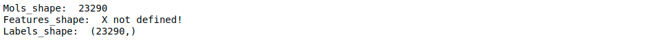
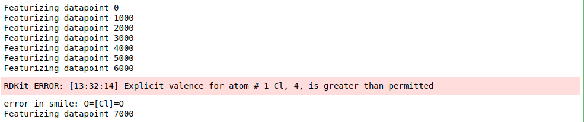
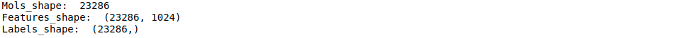
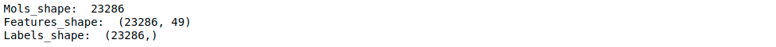
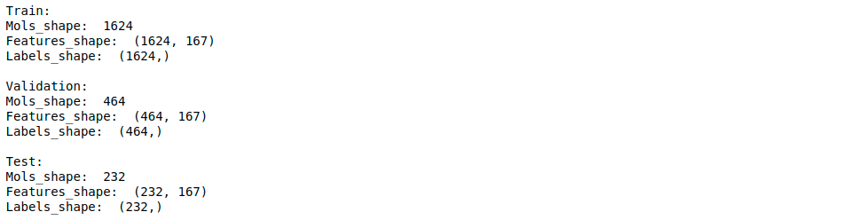
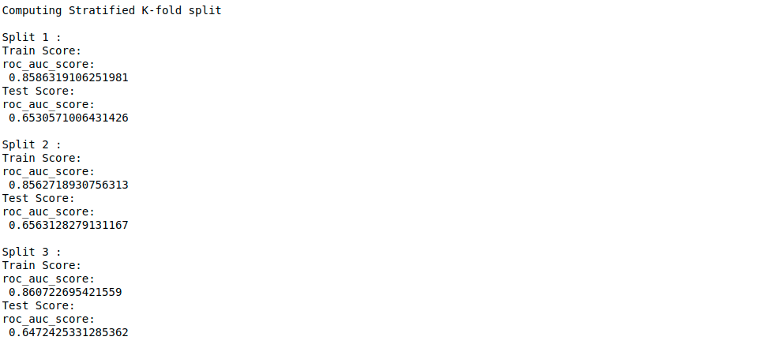

# DeepMol

### Description
DeepMol is a Python-based machine and deep learning framework for drug discovery. 
It offers a variety of functionalities that enable a smoother approach to many 
drug discovery and chemoinformatics problems. It uses Tensorflow, Keras, 
Scikit-learn and DeepChem to build custom ML and DL models or 
make use of pre-built ones. It uses the RDKit framework to perform 
operations on molecular data.

### Table of contents:

- [Requirements](#requirements)
- [Installation](#installation)
    - [Pip](#pip)
- [Getting Started](#getting-started)
    - [Load dataset from csv](#load-a-dataset-from-a-csv)
    - [Compound Standardization](#compound-standardization)
    - [Compound Featurization](#compound-featurization)
    - [Feature Selection](#feature-selection)
    - [Unsupervised Exploration](#unsupervised-exploration)
    - [Data Split](#data-split)
    - [Build, train and evaluate a model](#build-train-and-evaluate-a-model)
    - [Hyperparameter Optimization](#hyperparameter-optimization)
    - [Feature Importance (Shap Values)](#feature-importance-shap-values)
    - [Unbalanced Datasets](#unbalanced-datasets)
- [About Us](#about-us)
- [Citing DeepMol](#citing-deepmol)
  - [Related Publications](#publications-using-deepmol)
- [License](#licensing)


## Requirements

- rdkit
- tensorflow
- keras
- scikit-learn
- deepchem
- chembl_structure_pipeline
- shap
- imbalanced-learn
- umap-learn
- etc
  

## Installation

### Pip

Install DeepMol via pip:

If you intend to install all the deepmol modules' dependencies:

```bash
pip install deepmol[all]
```

Extra modules:

```bash
pip install deepmol[preprocessing]
pip install deepmol[machine_learning]
pip install deepmol[deep_learning]
```

Also, you should install mol2vec and its dependencies:

```bash
pip install git+https://github.com/samoturk/mol2vec#egg=mol2vec
```

### Docker

(IN PREPARATION - NOT FUNCTIONAL YET!)
1. Install [docker](https://docs.docker.com/install/).
2. Pull an existing image (X.XGb to download) from DockerHub:

```bash
docker pull XXX
```

or clone the repository and build it manually:

```bash
git clone https://github.com/BioSystemsUM/DeepMol.git
docker build ...
```

3. Create a container:
```bash
docker run ...
```

### Manually

(IN PREPARATION - NOT FUNCTIONAL YET!)

Alternatively, install dependencies and DeepMol manually.

1. Clone the repository:
```bash
git clone https://github.com/BioSystemsUM/DeepMol.git
```

3. Install dependencies:
```bash
python setup.py install
```
--->

## Getting Started

DeepMol is built in a modular way allowing the use of its methods for 
multiple tasks. It offers a complete workflow to perform ML and DL tasks 
using molecules represented as SMILES. It has modules that perform 
standard tasks such as the loading and standardization of the data, computing 
molecular features like molecular fingerprints, performing feature selection 
and data splitting. It also provides  methods to deal with unbalanced datasets, 
do unsupervised exploration of the data and compute feature importance as 
shap values.

The DeepMol framework is still under development, and it is currently at a 
pre-release version. New models and features will be added in the future.


### Load a dataset from a CSV

For now, it is only possible to load data directly from CSV files. Modules to 
load data from different file types and sources will be implemented in the 
future. These include JSON, SDF and FASTA files and directly from our 
databases.

To load data from a CSV it's only required to provide the math and molecules 
field name. Optionally, it is also possible to provide a field with some ids, 
the labels fields, features fields, features to keep (useful for instance 
to select only the features kept after feature selection) and the number of 
samples to load (by default loads the entire dataset).

```python
from deepmol.loaders.loaders import CSVLoader

# load a dataset from a CSV (define data path, field with the molecules,
# field with the labels (optional), field with ids (optional), etc).
dataset = CSVLoader(dataset_path='data_path.csv',
                    mols_field='Smiles',
                    labels_fields='Class',
                    id_field='ID')
dataset = dataset.create_dataset()

# print shape of the dataset (mols, X, y) 
dataset.get_shape()
```



### Compound Standardization

It is possible to standardize the loaded molecules using three option. Using
a basic standardizer that only does sanitization (Kekulize, check valencies, 
set aromaticity, conjugation and hybridization). A more complex standardizer can
be customized by choosing or not to perform specific tasks such as sanitization, 
remove isotope information, neutralize charges, remove stereochemistry and remove
smaller fragments. Another possibility is to use the ChEMBL Standardizer.

```python
# Option 1: Basic Standardizer
standardizer = BasicStandardizer().standardize(dataset)

# Option 2: Custom Standardizer
heavy_standardisation = {
    'REMOVE_ISOTOPE': True,
    'NEUTRALISE_CHARGE': True,
    'REMOVE_STEREO': True,
    'KEEP_BIGGEST': True,
    'ADD_HYDROGEN': True,
    'KEKULIZE': False,
    'NEUTRALISE_CHARGE_LATE': True}
standardizer2 = CustomStandardizer(heavy_standardisation).standardize(dataset)

# Option 3: ChEMBL Standardizer
standardizer3 = ChEMBLStandardizer().standardize(dataset)
```
### Compound Featurization

It is possible to compute multiple types of molecular fingerprints like Morgan
Fingerprints, MACCS Keys, Layered Fingerprints, RDK Fingerprints and AtomPair 
Fingerprints. Featurizers from DeepChem and molecular embeddings like the 
Mol2Vec can also be computed. More complex molecular embeddings like the 
Seq2Seq and transformer-based are in  development and will be added soon.

```python
from deepmol.compound_featurization import MorganFingerprint

# Compute morgan fingerprints for molecules in the previous loaded dataset
dataset = MorganFingerprint(radius=2, size=1024).featurize(dataset)
```



```python
#print shape of the dataset to see difference in the X shape
dataset.get_shape()
```



### Feature Selection

Regarding feature selection it is possible to do Low Variance Feature Selection, 
KBest, Percentile, Recursive Feature Elimination and selecting features based on 
importance weights.

```python
from deepmol.feature_selection import LowVarianceFS

# Feature Selection to remove features with low variance across molecules
dataset = LowVarianceFS(0.15).featureSelection(dataset)

# print shape of the dataset to see difference in the X shape (fewer features)
dataset.get_shape()
```



### Unsupervised Exploration

It is possible to do unsupervised exploration of the datasets using PCA, tSNE,
KMeans and UMAP.

```python
from deepmol.unsupervised.umap import UMAP

ump = UMAP().runUnsupervised(dataset)
```


### Data Split

Data can be split randomly or using stratified splitters. K-fold split, train-test
split and train-validation-test split can be used.

```python
from deepmol.splitters.splitters import SingletaskStratifiedSplitter

# Data Split
splitter = SingletaskStratifiedSplitter()
train_dataset, valid_dataset, test_dataset = splitter.train_valid_test_split(dataset=dataset, frac_train=0.7,
                                                                             frac_valid=0.15, frac_test=0.15)
print('Train:')
train_dataset.get_shape()
print('\nValidation:')
valid_dataset.get_shape()
print('\nTest:')
test_dataset.get_shape()
```



### Build, train and evaluate a model

It is possible use pre-built models from Scikit-Learn and DeepChem or build new
ones using keras layers. Wrappers for Scikit-Learn, Keras and DeepChem were 
implemented allowing evaluation of the models under a common workspace.

#### Scikit-Learn model example

Models can be imported from scikit-learn and wrapped using the SKlearnModel
module.

Check this **[jupyter notebook](examples/notebooks/RandomForestTest.ipynb)** for a complete example!

```python
from sklearn.ensemble import RandomForestClassifier
from deepmol.models.sklearn_models import SklearnModel

# Scikit-Learn Random Forest
rf = RandomForestClassifier()
# wrapper around scikit learn models
model = SklearnModel(model=rf)
# model training
model.fit(train_dataset)

from deepmol.metrics.metrics import Metric
from deepmol.metrics.metrics_functions import roc_auc_score

# cross validate model on the full dataset
model.cross_validate(dataset, Metric(roc_auc_score), folds=3)
```



```python
#evaluate the model using different metrics
metrics = [Metric(roc_auc_score), Metric(precision_score), Metric(accuracy_score), Metric(confusion_matrix), 
           Metric(classification_report)]

# evaluate the model on training data
print('Training Dataset: ')
train_score = model.evaluate(train_dataset, metrics)

# evaluate the model on training data
print('Validation Dataset: ')
valid_score = model.evaluate(valid_dataset, metrics)

# evaluate the model on training data
print('Test Dataset: ')
test_score = model.evaluate(test_dataset, metrics)
```


#### Keras model example

Example of how to build and wrap a keras model using the KerasModel module.

Check this **[jupyter notebook](examples/notebooks/test_keras.ipynb)** for a complete example!

```python
from tensorflow.keras.models import Sequential
from tensorflow.keras.layers import Dense, Dropout
from deepmol.metrics.metrics import Metric

input_dim = train_dataset.X.shape[1]


def create_model(optimizer='adam', dropout=0.5, input_dim=input_dim):
  # create model
  model = Sequential()
  model.add(Dense(12, input_dim=input_dim, activation='relu'))
  model.add(Dropout(dropout))
  model.add(Dense(8, activation='relu'))
  model.add(Dense(1, activation='sigmoid'))
  # Compile model
  model.compile(loss='binary_crossentropy', optimizer=optimizer, metrics=['accuracy'])
  return model


from deepmol.models.keras_models import KerasModel

model = KerasModel(create_model, epochs=5, verbose=1, optimizer='adam')

# train model
model.fit(train_dataset)

# make prediction on the test dataset with the model
model.predict(test_dataset)

# evaluate model using multiple metrics
metrics = [Metric(roc_auc_score),
           Metric(precision_score),
           Metric(accuracy_score),
           Metric(confusion_matrix),
           Metric(classification_report)]

print('Training set score:', model.evaluate(train_dataset, metrics))
print('Test set score:', model.evaluate(test_dataset, metrics))
```


#### DeepChem model example

Using DeepChem models:

Check this **[jupyter notebook](examples/notebooks/deepchem_test.ipynb)** for a complete example!

```python
from deepmol.compound_featurization import WeaveFeat
from deepchem.models import MPNNModel
from deepmol.models.deepchem_models import DeepChemModel
from deepmol.metrics.metrics import Metric
from deepmol.splitters.splitters import SingletaskStratifiedSplitter

ds = WeaveFeat().featurize(dataset)
splitter = SingletaskStratifiedSplitter()
train_dataset, valid_dataset, test_dataset = splitter.train_valid_test_split(dataset=ds, frac_train=0.6, frac_valid=0.2,
                                                                             frac_test=0.2)
mpnn = MPNNModel(n_tasks=1, n_pair_feat=14, n_atom_feat=75, n_hidden=75, T=1, M=1, mode='classification')
model_mpnn = DeepChemModel(mpnn)
# Model training
model_mpnn.fit(train_dataset)
valid_preds = model_mpnn.predict(valid_dataset)
test_preds = model_mpnn.predict(test_dataset)
# Evaluation
metrics = [Metric(roc_auc_score), Metric(precision_score), Metric(accuracy_score)]
print('Training Dataset: ')
train_score = model_mpnn.evaluate(train_dataset, metrics)
print('Valid Dataset: ')
valid_score = model_mpnn.evaluate(valid_dataset, metrics)
print('Test Dataset: ')
test_score = model_mpnn.evaluate(test_dataset, metrics)    
```

### Hyperparameter Optimization

Grid and randomized hyperparameter optimization is provided using cross-validation
or a held-out validation set.

```python
from deepmol.parameter_optimization.hyperparameter_optimization import HyperparameterOptimizerValidation,

HyperparameterOptimizerCV

# Hyperparameter Optimization (using the above created keras model)
optimizer = HyperparameterOptimizerValidation(create_model)

params_dict = {'optimizer': ['adam', 'rmsprop'],
               'dropout': [0.2, 0.4, 0.5]}

best_model, best_hyperparams, all_results = optimizer.hyperparameter_search(params_dict, train_dataset,
                                                                            valid_dataset, Metric(roc_auc_score))

print(best_hyperparams)
print(best_model)

# Evaluate model
best_model.evaluate(test_dataset, metrics)
```

### Feature Importance (Shap Values)

Explain the output of a machine learning model can be done using SHAP (SHapley 
Additive exPlanations) package. The features that most influenced (positively or
negatively) a certain prediction can be calculated and visualized in different 
ways:

```python
from deepmol.feature_importance import ShapValues

shap_calc = ShapValues(test_dataset, model)
shap_calc.computePermutationShap()
```


```python
shap_calc.plotSampleExplanation(index=1, plot_type='waterfall')
```


```python
shap_calc.plotFeatureExplanation(index=115)
```


#### Draw relevant features

It is possible to plot the ON bits (or some of them) in a molecule for MACCS Keys,
Morgan and RDK Fingeprints. IT is also possible to draw those bits on the 
respective molecule. This can be allied with the Shap Values calculation to 
highlight the zone of the molecule that most contributed to a certain prediction,
for instance, the substructure in the molecule that most contributed to its 
classification as an active or inactive molecule against a receptor.

```python
from deepmol.utils import draw_MACCS_Pattern

patt_number = 54
mol_number = 1

prediction = model.predict(test_dataset)[mol_number]
actual_value = test_dataset.y[mol_number]
print('Prediction: ', prediction)
print('Actual Value: ', actual_value)
smi = test_dataset.mols[mol_number]

draw_MACCS_Pattern(smi, patt_number)
```


### Unbalanced Datasets

Multiple methods to deal with unbalanced datasets can be used to do oversampling,
under-sampling or a mixture of both (Random, SMOTE, SMOTEENN, SMOTETomek and 
ClusterCentroids).

```python
from deepmol.imbalanced_learn.imbalanced_learn import SMOTEENN

train_dataset = SMOTEENN().sample(train_dataset)
```


## About Us

DeepMol is managed by a team of contributors from the BioSystems group 
at the Centre of Biological Engineering, University of Minho.

This research was financed by Portuguese Funds through FCT – Fundação para 
a Ciência e a Tecnologia.

## Citing DeepMol

Manuscript under preparation.

### Publications using DeepMol

Baptista D., Correia J., Pereira B., Rocha M. (2022) "A Comparison of Different Compound Representations for Drug Sensitivity Prediction". In: Rocha M., Fdez-Riverola F., Mohamad M.S., Casado-Vara R. (eds) Practical Applications of Computational Biology & Bioinformatics, 15th International Conference (PACBB 2021). PACBB 2021. Lecture Notes in Networks and Systems, vol 325. Springer, Cham. https://doi.org/10.1007/978-3-030-86258-9_15

Baptista, Delora, Correia, João, Pereira, Bruno and Rocha, Miguel. "Evaluating molecular representations in machine learning models for drug response prediction and interpretability" Journal of Integrative Bioinformatics, vol. 19, no. 3, 2022, pp. 20220006. https://doi.org/10.1515/jib-2022-0006

J. Capela, J. Correia, V. Pereira and M. Rocha, "Development of Deep Learning approaches to predict relationships between chemical structures and sweetness," 2022 International Joint Conference on Neural Networks (IJCNN), 2022, pp. 1-8, doi: 10.1109/IJCNN55064.2022.9891992. https://ieeexplore.ieee.org/abstract/document/9891992

<!---
DeepSweet (POSTER) ...
--->

## Licensing

DeepMol is under [BSD-2-Clause License](https://raw.githubusercontent.com/BioSystemsUM/DeepMol/master/LICENSE).