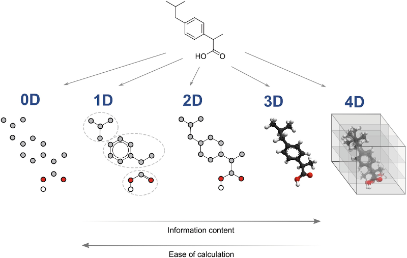

# Extracting features from molecules

## Introduction

Extracting features from molecules is a common task in machine learning. There are 5 different types of features: 0D, 1D, 2D, 3D, or 4D.

- 0D features are descriptors that describe the individual parts of the molecule together as a whole, such as the number of atoms, bond counts or the molecular weight.
- 1D features are descriptors that describe substructures in the molecule (e.g. molecular fingerprints).
- 2D features are descriptors that describe the molecular topology based on the graph representation of the molecules, e.g. the number of rings or the number of rotatable bonds.
- 3D features are descriptors geometrical descriptors that describe the molecule as a 3D structure.
- 4D features are descriptors that describe the molecule as a 4D structure. A new dimension is added to characterize the interactions between the molecule and the active site of a receptor or the multiple conformational states of the molecule, e.g. the molecular dynamics of the molecule.




Source : Molecular Descriptors for Structure–Activity Applications: A Hands-On Approach.

As we increase the level of information about a molecule (from 0D to 4D), we also increase the computational cost of calculating the features. For example, calculating 3D features requires the generation of 3D conformers, which can be computationally expensive for large molecules. In addition, some features may not be available for certain molecules, e.g. 3D features cannot be calculated for molecules that do not have a 3D structure. Fortunately, DeepMol provides methods for generating compound 3D structures.

DeepMol provides a number of featurization methods for generating features from molecules. These features can be used for a variety of tasks, such as virtual screening, drug design, and toxicity prediction. The featurization methods are implemented as classes in the deepmol.compound_featurization module. Each class has a featurize method that takes a dataset as input and returns a featurized dataset. The featurize method can be called directly on a dataset object or used in a pipeline with other featurization methods.

The following featurization methods are currently available in DeepMol:
   - MorganFingerprint
    - AtomPairFingerprint
    - LayeredFingerprint
    - RDKFingerprint
    - MACCSkeysFingerprint
    - TwoDimensionDescriptors
    - WeaveFeat
    - CoulombFeat
    - CoulombEigFeat
    - ConvMolFeat
    - MolGraphConvFeat
    - SmileImageFeat
    - SmilesSeqFeat
    - MolGanFeat
    - All3DDescriptors


<font size="5"> **Load the dataset** </font>

```python
from deepmol.loaders import CSVLoader, SDFLoader
from deepmol.compound_featurization import MorganFingerprint, TwoDimensionDescriptors, MACCSkeysFingerprint, \
    AtomPairFingerprint, LayeredFingerprint, RDKFingerprint

from deepmol.compound_featurization import WeaveFeat, CoulombFeat, CoulombEigFeat, ConvMolFeat, MolGraphConvFeat, \
        SmileImageFeat, SmilesSeqFeat, MolGanFeat, All3DDescriptors, generate_conformers_to_sdf_file

import numpy as np
```

```python
dataset = CSVLoader("../data/CHEMBL217_reduced.csv", id_field="Original_Entry_ID",
                    smiles_field="SMILES", labels_fields=["Activity_Flag"]).create_dataset()
```

    2023-06-06 16:43:55,572 — ERROR — Molecule with smiles: ClC1=C(N2CCN(O)(CC2)=C/C=C/CNC(=O)C=3C=CC(=CC3)C4=NC=CC=C4)C=CC=C1Cl removed from dataset.
    2023-06-06 16:43:55,574 — INFO — Assuming classification since there are less than 10 unique y values. If otherwise, explicitly set the mode to 'regression'!


    [16:43:55] Explicit valence for atom # 6 N, 5, is greater than permitted


## 1D features: fingerprints and structural keys


There are special codes called "structural keys" that have been created for various purposes in the field of chemistry.

They help with tasks like finding similar molecules or exploring different chemical structures. One specific type of structural keys is called the Molecular ACCess System (MACCS) keys.

These keys use binary digits (bits) to show whether certain parts of a molecule are present or not. For example, if a specific structural fragment exists in a molecule, the corresponding bit will be set to 1, and if it's not present, the bit will be set to 0. There are different versions of MACCS keys, but the most common ones are either 166 or 960 bits long. These keys provide a simplified representation of molecules, which is useful for various chemical analyses and comparisons. [1]

Hashed fingerprints are a type of chemical fingerprint that use a special function to convert patterns in molecules into a series of bits. The length of the fingerprint can be predetermined.

There are different types of fingerprints used in chemistry. Topological or path-based fingerprints, like Daylight fingerprints, provide information about how atoms are connected in a molecule. Circular fingerprints, such as ECFP, give information about the neighborhoods of atoms. These fingerprints are useful for quickly comparing similarities between molecules, studying the relationship between chemical structures and activities, and creating maps of chemical space.

Most fingerprints have been designed for small molecules and may not work well with larger ones. For example, ECFP4 is effective for virtual screening [2] and target prediction [3] with small molecules but may not accurately represent the overall features or structural differences of larger molecules [4].

On the other hand, atom-pair fingerprints, which describe molecular shape, are better suited for larger molecules [4]. However, they don't provide detailed structural information and may perform poorly in benchmarking studies with small molecules compared to substructure fingerprints like ECFP4 [4].


[1] L. David et al. “Molecular representations in AI-driven drug discovery: a review and practical guide”. In: Journal of Cheminformatics 12 (1 2020-12), p. 56

[2] S. Riniker and G. A. Landrum. “Open-source platform to benchmark fingerprints for ligand-based virtual screening”. In: Journal of cheminformatics 5.1 (2013), pp. 1–17

[3] M. Awale and J.-L. Reymond. “Polypharmacology browser PPB2: target prediction combining nearest neighbors with machine learning”. In: Journal of chemical information and modeling 59.1 (2018), pp. 10–17

[4] A. Capecchi, D. Probst, and J.-L. Reymond. “One molecular fingerprint to rule them all: drugs, biomolecules, and the metabolome”. In: Journal of cheminformatics 12.1 (2020), pp. 1–15


### Morgan Fingerprint

Morgan fingerprints, also known as circular fingerprints or Morgan/Circular fingerprints, are a type of molecular fingerprint that encodes the structural information of a molecule as a series of binary bitstrings.

These fingerprints are generated using the Morgan algorithm, which iteratively applies a circular pattern to a molecule, generating a series of concentric circles around each atom. The resulting bitstring is a binary representation of the presence or absence of certain substructures within a certain radius of each atom.

Morgan fingerprints are widely used in cheminformatics and computational chemistry for tasks such as molecular similarity analysis, virtual screening, and quantitative structure-activity relationship (QSAR) modeling. They are also computationally efficient and can be generated quickly for large sets of molecules, making them useful for high-throughput screening applications.


```python
MorganFingerprint(n_jobs=10).featurize(dataset, inplace=True)
```


```python
dataset.X.shape
```


    (16645, 2048)


```python
dataset.X[0]
```


    array([0., 1., 0., ..., 0., 0., 0.], dtype=float32)


```python
np.unique(dataset.X[0], return_counts=True)
```


    (array([0., 1.], dtype=float32), array([2006,   42]))


### Atom Pair Fingerprint

Atom pair fingerprint is a type of molecular fingerprinting method used in cheminformatics and computational chemistry. It encodes the presence or absence of pairs of atoms in a molecule, as well as the distance between them.

The method involves dividing a molecule into atom pairs and then counting the frequency of each pair in the molecule. The result is a binary bitstring that represents the presence or absence of each atom pair in the molecule. The bitstring is usually truncated to a fixed length to facilitate comparison and analysis.


```python
AtomPairFingerprint(n_jobs=10).featurize(dataset, inplace=True)
```


```python
dataset.X.shape
```


    (16645, 2048)


```python
dataset.X[0]
```


    array([0., 0., 0., ..., 0., 0., 0.], dtype=float32)


```python
np.unique(dataset.X[0], return_counts=True)
```


    (array([0., 1.], dtype=float32), array([1841,  207]))


### Layered Fingerprint

Layered fingerprints, also known as topological fingerprints, are a type of molecular fingerprinting method used in cheminformatics and computational chemistry. They encode the presence or absence of certain substructures or functional groups in a molecule, which are represented as binary bitstrings.

The method involves dividing a molecule into a series of layers, where each layer contains a different set of substructures or functional groups. The bitstring for each layer is generated by hashing the presence or absence of the substructures or functional groups in the layer. The final fingerprint is generated by concatenating the bitstrings for all layers, resulting in a binary bitstring that represents the presence or absence of all substructures or functional groups in the molecule.

More specifically, the algorithm of fingerprint generation finds all possible paths or subgraphs of specified lengths 
in the molecule based on the input parameters.

Iterating through the generated paths, the code calculates various hash layers based on the specified layer flags and 
stores them.

Depending on the layer flags, different features are considered, such as bond topology, bond orders, atom types, 
ring information, ring size, and aromaticity. By default, the fingerprint considers them all.

Each path's hash layers are sorted, and the distinct atom count in the path is added.

The path is hashed to generate a seed, and the seed is used to determine the bit position in the fingerprint.

If specified, the bit is set in the resulting fingerprint, and atom counts are updated if necessary.

```python
LayeredFingerprint(n_jobs=10).featurize(dataset, inplace=True)
```


```python
dataset.X.shape
```


    (16645, 2048)


```python
dataset.X[0]
```


    array([0., 0., 0., ..., 0., 0., 0.], dtype=float32)


```python
np.unique(dataset.X[0], return_counts=True)
```


    (array([0., 1.], dtype=float32), array([1485,  563]))


### RDK Fingerprint

Fingerprints from rdkit


```python
RDKFingerprint(n_jobs=10).featurize(dataset, inplace=True)
```


```python
dataset.X.shape
```


    (16645, 2048)


```python
dataset.X[0]
```


    array([1., 0., 1., ..., 0., 1., 1.], dtype=float32)


```python
np.unique(dataset.X[0], return_counts=True)
```


    (array([0., 1.], dtype=float32), array([1255,  793]))


### MACCS Keys Fingerprint

MACCS (Molecular ACCess System) keys are a type of binary molecular fingerprint used in cheminformatics and computational chemistry. They were developed by Molecular Design Limited (now part of Elsevier) and are widely used in the field.

The MACCS keys encode the presence or absence of certain molecular fragments or substructures in a molecule as a binary bitstring. The fragments used are based on a predefined set of SMARTS patterns, which represent specific substructures or features of a molecule.

The MACCS keys consist of 167 bit positions, with each bit representing the presence or absence of a specific fragment in the molecule. The bitstring can be used to compare the similarity of two molecules or to search a large database of molecules for compounds with similar structures or properties.


```python
MACCSkeysFingerprint(n_jobs=10).featurize(dataset, inplace=True)
```


```python
dataset.X.shape
```


    (16645, 167)


```python
dataset.X[0]
```


    array([0., 0., 0., 0., 0., 0., 0., 0., 0., 0., 0., 0., 0., 0., 0., 0., 0.,
           0., 0., 0., 0., 0., 0., 0., 0., 0., 0., 0., 0., 0., 0., 0., 0., 0.,
           0., 0., 0., 0., 0., 0., 0., 0., 1., 1., 0., 0., 0., 0., 0., 0., 0.,
           0., 0., 0., 0., 0., 0., 0., 0., 0., 0., 0., 1., 0., 0., 1., 0., 0.,
           0., 0., 0., 0., 0., 0., 0., 1., 0., 0., 0., 0., 1., 0., 0., 1., 0.,
           1., 0., 1., 0., 0., 0., 0., 1., 1., 0., 0., 1., 1., 0., 0., 0., 0.,
           0., 0., 0., 0., 0., 1., 0., 0., 1., 0., 0., 1., 0., 0., 0., 1., 0.,
           0., 0., 1., 1., 0., 0., 1., 1., 1., 0., 0., 0., 1., 0., 1., 1., 1.,
           0., 1., 0., 1., 0., 0., 1., 1., 1., 1., 1., 0., 1., 0., 1., 1., 1.,
           0., 0., 0., 1., 1., 1., 1., 1., 1., 1., 1., 1., 1., 0.],
          dtype=float32)


```python
np.unique(dataset.X[0], return_counts=True)
```


    (array([0., 1.], dtype=float32), array([120,  47]))


## 0D, 1D and 2D Descriptors

We provide all 0D, 2D descriptors and some 1D descriptors from rdkit in only one function. These include: 
- **EState index descriptors**: The EState indices are calculated based on a set of predefined atomic parameters, such as electronegativity, atomic polarizability, and resonance effects. These indices quantify the electronic characteristics of individual atoms in a molecule.
    - **MaxAbsEStateIndex (MAEstate)**: Maximum absolute EState index - The MAEstate specifically represents the highest absolute EState index value among all the atoms in a molecule. It indicates the atom with the largest charge magnitude, reflecting its potential reactivity or contribution to chemical properties.
    - **MaxEStateIndex:**: Maximum EState Index - The MaxEStateIndex specifically represents the highest EState index value among all the atoms in a molecule. It indicates the atom with the largest charge or electronic density, reflecting its potential reactivity or significance in the molecule's properties.
    - **MinAbsEStateIndex**: Minimum absolute EState index - The MinAbsEStateIndex specifically represents the lowest absolute EState index value among all the atoms in a molecule.
    - **MinEStateIndex**: Minimum EState index - The MinEStateIndex represents the lowest EState index value among all the atoms in a molecule.
- **QED**: quantitative estimation of drug-likeness - a computational algorithm used to quantitatively assess the drug-likeness of a molecule. It combines various molecular descriptors, including 2D properties, to generate a single numerical score that represents the overall drug-likeness of the molecule. 
- **Molecular weight descriptors**:
    - **MolWt**: Molecular weight. 
    - **HeavyAtomMolWt**: The average molecular weight of the molecule ignoring hydrogens.
    - **ExactMolWt**: The exact molecular weight of the molecule.
- **Electron descriptors**:
    - **NumValenceElectrons**: The number of valence electrons the molecule has.
    - **NumRadicalElectrons**: The number of radical electrons the molecule has.
- **Charge descriptors**:
    - **MaxPartialCharge**: Maximum partial charge;
    - **MinPartialCharge**: Minimum partial charge;
    - **MaxAbsPartialCharge**: Maximum absolute partial charge;
    - **MinAbsPartialCharge**: Minimum absolute partial charge;
    
- **Morgan fingerprint density** - quantify the frequency of occurrence of specific substructures within the molecule at a local level, taking into account their immediate surroundings. Higher values of density indicate a higher density of unique substructures in the molecule, while lower values indicate fewer unique substructures or a more uniform distribution of substructures.
    - **FpDensityMorgan1**: Fingerprint Density for Morgan Radius 1.
    - **FpDensityMorgan2**: Fingerprint Density for Morgan Radius 2.
    - **FpDensityMorgan3**: Fingerprint Density for Morgan Radius 3.
- **BCUT2D descriptors**: BCUT2D descriptors are based on the Burden matrix, which encodes bond strengths between atoms in the molecule. 
It changes the diagonal elements of the matrix to include the atom properties and then performs eigenvalue decomposition to obtain the highest and lowest eigenvalues.

    - **BCUT2D_MWHI**: Incorporates atom masses in the Burden matrix - returns the highest eigenvalue. 

    - **BCUT2D_MWLOW**: Incorporates atom masses in the Burden matrix - returns the lowest eigenvalue.

    - **BCUT2D_CHGHI**: Incorporates atom charges in the Burden matrix - returns the highest eigenvalue.
  
    - **BCUT2D_CHGLO**: Incorporates atom charges in the Burden matrix - returns the lowest eigenvalue.

    - **BCUT2D_LOGPHI**: Incorporates atom logarithms of the partition coefficient (logP) in the 
Burden matrix - returns the highest eigenvalue.
    - **BCUT2D_LOGPLOW**: Incorporates atom logarithms of the partition coefficient (logP) in the
Burden matrix - returns the lowest eigenvalue.
    - **BCUT2D_MRHI**: Incorporates atom molar refractivity in the Burden matrix - returns the highest eigenvalue.
    - **BCUT2D_MRLOW**: Incorporates atom molar refractivity in the Burden matrix - returns the lowest eigenvalue.
  
- **AvgIpc**: the average information content of the coefficients of the characteristic polynomial of the adjacency matrix of a hydrogen-suppressed graph of a molecule.

- **Ipc**: the information content of the coefficients of the characteristic polynomial of the adjacency matrix of a hydrogen-suppressed graph of a molecule.

- **BalabanJ**: Balaban's J index. It quantifies the molecular topological structure by considering the connectivity 
of atoms and bonds in the molecule. See [here](http://www.codessa-pro.com/descriptors/topo/balaban.htm).

- **BertzCT**: Bertz complexity index. It measures the topological complexity or branching of a molecule based on its structural connectivity.

- **Chi0, Chi1, Chi2n, Chi3v, etc.**: the Chi descriptors represent the count of specific path patterns in the molecule 
and are calculated based on the Hall-Kier delta values or on the deviation of an atom's valence electron count 
from the expected count based on its atomic number.

- **HallKierAlpha**: Hall-Kier alpha value. It describes the flexibility or rigidity of atoms in a molecule.

- **Kappa1, Kappa2, Kappa3**: Kappa shape indices. They describe the shape of a molecule based on the distribution of 
bond lengths and angles. These descriptors are derived from the Hall-Kier alpha descriptor and the number of 
paths of specific lengths in the molecule.

- **LabuteASA**: Labute's Approximate Surface Area. It estimates the solvent-accessible surface area of a molecule, which is relevant for its solubility and permeability properties.

- **PEOE_VSA1, PEOE_VSA2, PEOE_VSA3, etc.**: These descriptors Calculates the PEOE 
(Partial Equalization of Orbital Electronegativity) VSA (surface area contributions of atoms or groups of atoms in a molecule) 
for a molecule by assigning atom contributions to predefined bins based on their Labute ASA and Gasteiger charge values.

- **SMR_VSA1, SMR_VSA2, SMR_VSA3, etc.**: Calculates the SMR (Molar Refractivity) VSA for a molecule by assigning 
atom contributions to predefined bins based on their Labute ASA and MR values.

- **SlogP_VSA1, SlogP_VSA2, SlogP_VSA3, etc.**: Calculates the SlogP (log of the octanol/water partition coefficient)
VSA for a molecule by assigning atom contributions to predefined bins based on their Labute ASA and SlogP values.

- **EState_VSA1, EState_VSA2, EState_VSA3, etc.**: Calculates the EState (E-State) VSA for a molecule by assigning
atom contributions to predefined bins based on their Labute ASA and EState values.

- **FractionCSP3**: Fraction of sp3-hybridized carbon atoms in the molecule.

- **MolLogP**: Molar logarithm of the partition coefficient (logP). It quantifies the lipophilicity or hydrophobicity of a molecule, which is important for its distribution and permeability properties.

- **TPSA**: Topological polar surface area. It estimates the surface area of a molecule that is involved in polar interactions, which is relevant for its solubility and biological activity.

- **NumHAcceptors, NumHDonors, NumHeteroatoms, etc.**: These descriptors count the number of hydrogen bond acceptor groups, hydrogen bond donor groups, heteroatoms (non-carbon atoms), etc., present in the molecule. They provide information about the potential for specific molecular interactions.

- **RingCount**: Number of rings in the molecule. It indicates the level of molecular complexity and rigidity.

- **fr_Al_COO, fr_ArN, fr_COO, fr_Ph_OH, etc**.: These descriptors represent the count of specific functional groups or substructures in the molecule. They provide information about the presence of particular chemical moieties.

More information about the descriptors can be found [here](https://datagrok.ai/help/domains/chem/descriptors).

```python
TwoDimensionDescriptors(n_jobs=10).featurize(dataset, inplace=True)
```


```python
dataset.feature_names
```


    array(['MaxAbsEStateIndex', 'MaxEStateIndex', 'MinAbsEStateIndex',
           'MinEStateIndex', 'qed', 'MolWt', 'HeavyAtomMolWt', 'ExactMolWt',
           'NumValenceElectrons', 'NumRadicalElectrons', 'MaxPartialCharge',
           'MinPartialCharge', 'MaxAbsPartialCharge', 'MinAbsPartialCharge',
           'FpDensityMorgan1', 'FpDensityMorgan2', 'FpDensityMorgan3',
           'BCUT2D_MWHI', 'BCUT2D_MWLOW', 'BCUT2D_CHGHI', 'BCUT2D_CHGLO',
           'BCUT2D_LOGPHI', 'BCUT2D_LOGPLOW', 'BCUT2D_MRHI', 'BCUT2D_MRLOW',
           'AvgIpc', 'BalabanJ', 'BertzCT', 'Chi0', 'Chi0n', 'Chi0v', 'Chi1',
           'Chi1n', 'Chi1v', 'Chi2n', 'Chi2v', 'Chi3n', 'Chi3v', 'Chi4n',
           'Chi4v', 'HallKierAlpha', 'Ipc', 'Kappa1', 'Kappa2', 'Kappa3',
           'LabuteASA', 'PEOE_VSA1', 'PEOE_VSA10', 'PEOE_VSA11', 'PEOE_VSA12',
           'PEOE_VSA13', 'PEOE_VSA14', 'PEOE_VSA2', 'PEOE_VSA3', 'PEOE_VSA4',
           'PEOE_VSA5', 'PEOE_VSA6', 'PEOE_VSA7', 'PEOE_VSA8', 'PEOE_VSA9',
           'SMR_VSA1', 'SMR_VSA10', 'SMR_VSA2', 'SMR_VSA3', 'SMR_VSA4',
           'SMR_VSA5', 'SMR_VSA6', 'SMR_VSA7', 'SMR_VSA8', 'SMR_VSA9',
           'SlogP_VSA1', 'SlogP_VSA10', 'SlogP_VSA11', 'SlogP_VSA12',
           'SlogP_VSA2', 'SlogP_VSA3', 'SlogP_VSA4', 'SlogP_VSA5',
           'SlogP_VSA6', 'SlogP_VSA7', 'SlogP_VSA8', 'SlogP_VSA9', 'TPSA',
           'EState_VSA1', 'EState_VSA10', 'EState_VSA11', 'EState_VSA2',
           'EState_VSA3', 'EState_VSA4', 'EState_VSA5', 'EState_VSA6',
           'EState_VSA7', 'EState_VSA8', 'EState_VSA9', 'VSA_EState1',
           'VSA_EState10', 'VSA_EState2', 'VSA_EState3', 'VSA_EState4',
           'VSA_EState5', 'VSA_EState6', 'VSA_EState7', 'VSA_EState8',
           'VSA_EState9', 'FractionCSP3', 'HeavyAtomCount', 'NHOHCount',
           'NOCount', 'NumAliphaticCarbocycles', 'NumAliphaticHeterocycles',
           'NumAliphaticRings', 'NumAromaticCarbocycles',
           'NumAromaticHeterocycles', 'NumAromaticRings', 'NumHAcceptors',
           'NumHDonors', 'NumHeteroatoms', 'NumRotatableBonds',
           'NumSaturatedCarbocycles', 'NumSaturatedHeterocycles',
           'NumSaturatedRings', 'RingCount', 'MolLogP', 'MolMR', 'fr_Al_COO',
           'fr_Al_OH', 'fr_Al_OH_noTert', 'fr_ArN', 'fr_Ar_COO', 'fr_Ar_N',
           'fr_Ar_NH', 'fr_Ar_OH', 'fr_COO', 'fr_COO2', 'fr_C_O',
           'fr_C_O_noCOO', 'fr_C_S', 'fr_HOCCN', 'fr_Imine', 'fr_NH0',
           'fr_NH1', 'fr_NH2', 'fr_N_O', 'fr_Ndealkylation1',
           'fr_Ndealkylation2', 'fr_Nhpyrrole', 'fr_SH', 'fr_aldehyde',
           'fr_alkyl_carbamate', 'fr_alkyl_halide', 'fr_allylic_oxid',
           'fr_amide', 'fr_amidine', 'fr_aniline', 'fr_aryl_methyl',
           'fr_azide', 'fr_azo', 'fr_barbitur', 'fr_benzene',
           'fr_benzodiazepine', 'fr_bicyclic', 'fr_diazo',
           'fr_dihydropyridine', 'fr_epoxide', 'fr_ester', 'fr_ether',
           'fr_furan', 'fr_guanido', 'fr_halogen', 'fr_hdrzine', 'fr_hdrzone',
           'fr_imidazole', 'fr_imide', 'fr_isocyan', 'fr_isothiocyan',
           'fr_ketone', 'fr_ketone_Topliss', 'fr_lactam', 'fr_lactone',
           'fr_methoxy', 'fr_morpholine', 'fr_nitrile', 'fr_nitro',
           'fr_nitro_arom', 'fr_nitro_arom_nonortho', 'fr_nitroso',
           'fr_oxazole', 'fr_oxime', 'fr_para_hydroxylation', 'fr_phenol',
           'fr_phenol_noOrthoHbond', 'fr_phos_acid', 'fr_phos_ester',
           'fr_piperdine', 'fr_piperzine', 'fr_priamide', 'fr_prisulfonamd',
           'fr_pyridine', 'fr_quatN', 'fr_sulfide', 'fr_sulfonamd',
           'fr_sulfone', 'fr_term_acetylene', 'fr_tetrazole', 'fr_thiazole',
           'fr_thiocyan', 'fr_thiophene', 'fr_unbrch_alkane', 'fr_urea'],
          dtype='<U24')


```python
dataset.X[0]
```


    array([ 1.2915942e+01,  1.2915942e+01,  1.5547052e-02, -1.0479454e+00,
            6.2784576e-01,  3.2834299e+02,  3.1120700e+02,  3.2812231e+02,
            1.2400000e+02,  0.0000000e+00,  1.9552433e-01, -4.9668738e-01,
            4.9668738e-01,  1.9552433e-01,  1.1250000e+00,  1.8750000e+00,
            2.5833333e+00,  1.9142143e+01,  1.0232034e+01,  2.1378713e+00,
           -2.1238039e+00,  2.2726576e+00, -2.0836904e+00,  5.4712963e+00,
            2.0794968e-01,  2.9879730e+00,  1.8310844e+00,  8.3053522e+02,
            1.7104084e+01,  1.2978706e+01,  1.2978706e+01,  1.1562881e+01,
            7.3246827e+00,  7.3246827e+00,  5.2568851e+00,  5.2568851e+00,
            3.6155939e+00,  3.6155939e+00,  2.3750753e+00,  2.3750753e+00,
           -2.9900000e+00,  3.7483522e+05,  1.5888650e+01,  6.6362123e+00,
            3.3332713e+00,  1.3811201e+02,  2.0266706e+01,  1.1566732e+01,
            1.2107889e+01,  0.0000000e+00,  0.0000000e+00,  0.0000000e+00,
            4.5670996e+00,  4.3904152e+00,  0.0000000e+00,  0.0000000e+00,
            6.0663671e+00,  3.6398201e+01,  2.9580416e+01,  1.2797184e+01,
            1.9340332e+01,  5.6873865e+00,  0.0000000e+00,  4.5670996e+00,
            0.0000000e+00,  6.2279010e+00,  1.2426586e+01,  7.2174820e+01,
            0.0000000e+00,  1.7316887e+01,  1.0053652e+01,  1.0077802e+01,
            1.1629500e+01,  0.0000000e+00,  2.1889952e+01,  0.0000000e+00,
            5.8172207e+00,  1.1791352e+01,  6.0794147e+01,  0.0000000e+00,
            5.6873865e+00,  0.0000000e+00,  6.6650002e+01,  6.2279010e+00,
            1.4603470e+01,  0.0000000e+00,  1.1697209e+01,  2.2687737e+01,
            0.0000000e+00,  3.4898933e+01,  3.1505743e+01,  6.0663671e+00,
            5.3167887e+00,  4.7368631e+00,  1.9622860e+01,  0.0000000e+00,
            0.0000000e+00,  2.3247818e+01,  1.7400438e+00,  2.9371008e-01,
            1.4294580e+01,  5.6842041e-01,  0.0000000e+00,  1.5659007e+00,
            1.1111111e-01,  2.4000000e+01,  3.0000000e+00,  5.0000000e+00,
            0.0000000e+00,  0.0000000e+00,  0.0000000e+00,  2.0000000e+00,
            1.0000000e+00,  3.0000000e+00,  5.0000000e+00,  3.0000000e+00,
            6.0000000e+00,  5.0000000e+00,  0.0000000e+00,  0.0000000e+00,
            0.0000000e+00,  3.0000000e+00,  3.4335999e+00,  8.8968300e+01,
            0.0000000e+00,  1.0000000e+00,  1.0000000e+00,  0.0000000e+00,
            0.0000000e+00,  1.0000000e+00,  0.0000000e+00,  1.0000000e+00,
            0.0000000e+00,  0.0000000e+00,  0.0000000e+00,  0.0000000e+00,
            0.0000000e+00,  0.0000000e+00,  0.0000000e+00,  1.0000000e+00,
            1.0000000e+00,  0.0000000e+00,  0.0000000e+00,  0.0000000e+00,
            0.0000000e+00,  0.0000000e+00,  0.0000000e+00,  0.0000000e+00,
            0.0000000e+00,  0.0000000e+00,  0.0000000e+00,  0.0000000e+00,
            0.0000000e+00,  1.0000000e+00,  0.0000000e+00,  0.0000000e+00,
            0.0000000e+00,  0.0000000e+00,  2.0000000e+00,  0.0000000e+00,
            0.0000000e+00,  0.0000000e+00,  0.0000000e+00,  0.0000000e+00,
            0.0000000e+00,  1.0000000e+00,  0.0000000e+00,  0.0000000e+00,
            1.0000000e+00,  0.0000000e+00,  0.0000000e+00,  0.0000000e+00,
            0.0000000e+00,  0.0000000e+00,  0.0000000e+00,  0.0000000e+00,
            0.0000000e+00,  0.0000000e+00,  0.0000000e+00,  1.0000000e+00,
            0.0000000e+00,  0.0000000e+00,  0.0000000e+00,  0.0000000e+00,
            0.0000000e+00,  0.0000000e+00,  0.0000000e+00,  0.0000000e+00,
            0.0000000e+00,  0.0000000e+00,  0.0000000e+00,  0.0000000e+00,
            0.0000000e+00,  0.0000000e+00,  0.0000000e+00,  0.0000000e+00,
            0.0000000e+00,  0.0000000e+00,  0.0000000e+00,  0.0000000e+00,
            0.0000000e+00,  0.0000000e+00,  0.0000000e+00,  0.0000000e+00,
            0.0000000e+00,  0.0000000e+00,  0.0000000e+00,  0.0000000e+00,
            0.0000000e+00], dtype=float32)


## 3D descriptors

### Generating Conformers and exporting to a SDF file

3D structures can be generated with DeepMol and being exported to a file.

We start by generating conformers with **ETKDG** (Experimental-Torsion basic Knowledge Distance Geometry) algorithm. The ETKDG method is a widely used algorithm for generating low-energy conformers of small organic molecules. It is an extension of the original **KDG** (Knowledge Distance Geometry) method and incorporates additional efficiency enhancements. 

The **ETKDG** method combines random sampling with knowledge-based rules and efficient energy evaluations to generate a diverse set of low-energy conformers for small organic molecules. It strikes a balance between computational efficiency and conformational coverage, making it a popular choice for various molecular modeling and drug discovery applications.

After that **MMFF** (Merck Molecular Force Field) and **UFF** (Universal Force Field) algorithms. They commonly use force fields for optimizing conformers of small organic molecules. Both force fields calculate the potential energy of a molecule based on its geometry and provide a set of atomic forces that guide the conformational search towards more stable conformations.

You can generate conformers and export them to a SDF files as follow:


```python
dataset = CSVLoader("../data/CHEMBL217_reduced.csv", id_field="Original_Entry_ID",
                    smiles_field="SMILES", labels_fields=["Activity_Flag"]).create_dataset()
generate_conformers_to_sdf_file(dataset, "CHEMBL217_conformers.sdf", n_conformations=1, threads=15,max_iterations=3)
```

If you rather want to read directly from a SDF file, you can use the SDFLoader class:


```python
dataset = SDFLoader("../data/CHEMBL217_conformers.sdf", id_field="_ID", labels_fields=["_Class"]).create_dataset()
```

### RDKit 3D descriptors

- **AutoCorr3D**: AutoCorr3D is a type of 3D descriptor that captures spatial autocorrelation patterns in a molecule. It quantifies the distribution and arrangement of properties within a three-dimensional grid overlaid on the molecule's structure.
- **RadialDistributionFunction**: The Radial Distribution Function (RDF), also known as the pair correlation function, is a 3D descriptor that characterizes the distribution of particles or atoms in a system based on their distances from a reference particle.
- **PlaneOfBestFit**: the Plane of Best Fit is a geometric descriptor that represents the optimal plane that fits a set of points in three-dimensional space. It is also known as the least squares plane or the best-fitting plane.
- **MORSE**: descriptors are based on an idea of obtaining information from the 3D atomic coordinates by the transform used in electron diffraction studies for preparing theoretical scattering curves. A generalized scattering function, called the molecular transform, can be used as an functional basis for deriving, from a known molecular structure, the specific analytic relationship of both X-ray and electron diffraction.
- **WHIM** stands for Weighted Holistic Invariant Molecular descriptors. It is a set of molecular descriptors that captures various aspects of a molecule's structure and properties. WHIM descriptors are calculated based on the spatial distribution of atoms within a molecule. They consider interatomic distances, atomic properties, and connectivity patterns to generate a quantitative representation of the molecule.
- **Radius of Gyration**: The radius of gyration is a measure of the spatial extent or compactness of a molecule. It quantifies the distribution of atoms around the center of mass of the molecule and provides information about its overall size and shape.
- **Inertial Shape Factor**: The inertial shape factor is a descriptor that provides information about the molecular shape and symmetry based on its moments of inertia. It quantifies how the mass is distributed within a molecule and is used to characterize its rotational behavior.
- **Eccentricity**: Eccentricity is a descriptor that quantifies the degree of elongation or distortion of a molecule from a perfectly spherical shape. It provides information about the symmetry and asymmetry of the molecule.
- **Asphericity**: Asphericity is a descriptor that measures the degree of deviation of a molecule from a perfectly spherical shape. It provides information about the non-sphericity or distortion of a molecule's geometry.
- **SpherocityIndex**: The spherocity index is a descriptor that quantifies the spherical nature of a molecule or object. It provides a measure of how closely a molecule resembles a perfect sphere.
- **PrincipalMomentsOfInertia**: The principal moments of inertia are descriptors that characterize the rotational behavior of a molecule around its principal axes. They provide information about the distribution of mass or volume within the molecule and its rotational symmetry.
- **NormalizedPrincipalMomentsRatios**: Normalized Principal Moments Ratios: Normalized principal moments ratios are descriptors that provide information about the relative magnitude of the principal moments of inertia of a molecule. They are calculated by normalizing the eigenvalues of the moment of inertia tensor.

You can either generate the conformers or read them from a SDF file as shown above. Then, you can featurize the dataset with all the above features as follow:


```python
All3DDescriptors(mandatory_generation_of_conformers=False).featurize(dataset, inplace=True)
```


```python
dataset.X
```


    array([[7.7435791e-01, 1.3100000e-01, 3.1299999e-01, ..., 6.4344002e+01,
            7.2148003e+01, 7.0723000e+01],
           [1.7659803e-01, 1.2600000e-01, 3.0399999e-01, ..., 9.9838997e+01,
            8.5703003e+01, 7.8072998e+01],
           [4.8933503e-01, 1.0600000e-01, 2.4300000e-01, ..., 1.1920000e+02,
            1.1242600e+02, 1.1243400e+02],
           ...,
           [9.3339241e-01, 5.0999999e-02, 1.1900000e-01, ..., 1.2269430e+03,
            1.2413199e+03, 1.4608800e+03],
           [7.7761173e-01, 4.8999999e-02, 1.2100000e-01, ..., 1.2056530e+03,
            1.0074610e+03, 1.1707830e+03],
           [4.8907563e-01, 5.0999999e-02, 1.3200000e-01, ..., 1.0148000e+03,
            1.0399250e+03, 8.3022101e+02]], dtype=float32)


```python
dataset.feature_names
```


    array(['Asphericity', 'AUTOCORR3D_0', 'AUTOCORR3D_1', 'AUTOCORR3D_2',
           'AUTOCORR3D_3', 'AUTOCORR3D_4', 'AUTOCORR3D_5', 'AUTOCORR3D_6',
           'AUTOCORR3D_7', 'AUTOCORR3D_8', 'AUTOCORR3D_9', 'AUTOCORR3D_10',
           'AUTOCORR3D_11', 'AUTOCORR3D_12', 'AUTOCORR3D_13', 'AUTOCORR3D_14',
           'AUTOCORR3D_15', 'AUTOCORR3D_16', 'AUTOCORR3D_17', 'AUTOCORR3D_18',
           'AUTOCORR3D_19', 'AUTOCORR3D_20', 'AUTOCORR3D_21', 'AUTOCORR3D_22',
           'AUTOCORR3D_23', 'AUTOCORR3D_24', 'AUTOCORR3D_25', 'AUTOCORR3D_26',
           'AUTOCORR3D_27', 'AUTOCORR3D_28', 'AUTOCORR3D_29', 'AUTOCORR3D_30',
           'AUTOCORR3D_31', 'AUTOCORR3D_32', 'AUTOCORR3D_33', 'AUTOCORR3D_34',
           'AUTOCORR3D_35', 'AUTOCORR3D_36', 'AUTOCORR3D_37', 'AUTOCORR3D_38',
           'AUTOCORR3D_39', 'AUTOCORR3D_40', 'AUTOCORR3D_41', 'AUTOCORR3D_42',
           'AUTOCORR3D_43', 'AUTOCORR3D_44', 'AUTOCORR3D_45', 'AUTOCORR3D_46',
           'AUTOCORR3D_47', 'AUTOCORR3D_48', 'AUTOCORR3D_49', 'AUTOCORR3D_50',
           'AUTOCORR3D_51', 'AUTOCORR3D_52', 'AUTOCORR3D_53', 'AUTOCORR3D_54',
           'AUTOCORR3D_55', 'AUTOCORR3D_56', 'AUTOCORR3D_57', 'AUTOCORR3D_58',
           'AUTOCORR3D_59', 'AUTOCORR3D_60', 'AUTOCORR3D_61', 'AUTOCORR3D_62',
           'AUTOCORR3D_63', 'AUTOCORR3D_64', 'AUTOCORR3D_65', 'AUTOCORR3D_66',
           'AUTOCORR3D_67', 'AUTOCORR3D_68', 'AUTOCORR3D_69', 'AUTOCORR3D_70',
           'AUTOCORR3D_71', 'AUTOCORR3D_72', 'AUTOCORR3D_73', 'AUTOCORR3D_74',
           'AUTOCORR3D_75', 'AUTOCORR3D_76', 'AUTOCORR3D_77', 'AUTOCORR3D_78',
           'AUTOCORR3D_79', 'Eccentricity', 'InertialShapeFactor', 'MORSE_0',
           'MORSE_1', 'MORSE_2', 'MORSE_3', 'MORSE_4', 'MORSE_5', 'MORSE_6',
           'MORSE_7', 'MORSE_8', 'MORSE_9', 'MORSE_10', 'MORSE_11',
           'MORSE_12', 'MORSE_13', 'MORSE_14', 'MORSE_15', 'MORSE_16',
           'MORSE_17', 'MORSE_18', 'MORSE_19', 'MORSE_20', 'MORSE_21',
           'MORSE_22', 'MORSE_23', 'MORSE_24', 'MORSE_25', 'MORSE_26',
           'MORSE_27', 'MORSE_28', 'MORSE_29', 'MORSE_30', 'MORSE_31',
           'MORSE_32', 'MORSE_33', 'MORSE_34', 'MORSE_35', 'MORSE_36',
           'MORSE_37', 'MORSE_38', 'MORSE_39', 'MORSE_40', 'MORSE_41',
           'MORSE_42', 'MORSE_43', 'MORSE_44', 'MORSE_45', 'MORSE_46',
           'MORSE_47', 'MORSE_48', 'MORSE_49', 'MORSE_50', 'MORSE_51',
           'MORSE_52', 'MORSE_53', 'MORSE_54', 'MORSE_55', 'MORSE_56',
           'MORSE_57', 'MORSE_58', 'MORSE_59', 'MORSE_60', 'MORSE_61',
           'MORSE_62', 'MORSE_63', 'MORSE_64', 'MORSE_65', 'MORSE_66',
           'MORSE_67', 'MORSE_68', 'MORSE_69', 'MORSE_70', 'MORSE_71',
           'MORSE_72', 'MORSE_73', 'MORSE_74', 'MORSE_75', 'MORSE_76',
           'MORSE_77', 'MORSE_78', 'MORSE_79', 'MORSE_80', 'MORSE_81',
           'MORSE_82', 'MORSE_83', 'MORSE_84', 'MORSE_85', 'MORSE_86',
           'MORSE_87', 'MORSE_88', 'MORSE_89', 'MORSE_90', 'MORSE_91',
           'MORSE_92', 'MORSE_93', 'MORSE_94', 'MORSE_95', 'MORSE_96',
           'MORSE_97', 'MORSE_98', 'MORSE_99', 'MORSE_100', 'MORSE_101',
           'MORSE_102', 'MORSE_103', 'MORSE_104', 'MORSE_105', 'MORSE_106',
           'MORSE_107', 'MORSE_108', 'MORSE_109', 'MORSE_110', 'MORSE_111',
           'MORSE_112', 'MORSE_113', 'MORSE_114', 'MORSE_115', 'MORSE_116',
           'MORSE_117', 'MORSE_118', 'MORSE_119', 'MORSE_120', 'MORSE_121',
           'MORSE_122', 'MORSE_123', 'MORSE_124', 'MORSE_125', 'MORSE_126',
           'MORSE_127', 'MORSE_128', 'MORSE_129', 'MORSE_130', 'MORSE_131',
           'MORSE_132', 'MORSE_133', 'MORSE_134', 'MORSE_135', 'MORSE_136',
           'MORSE_137', 'MORSE_138', 'MORSE_139', 'MORSE_140', 'MORSE_141',
           'MORSE_142', 'MORSE_143', 'MORSE_144', 'MORSE_145', 'MORSE_146',
           'MORSE_147', 'MORSE_148', 'MORSE_149', 'MORSE_150', 'MORSE_151',
           'MORSE_152', 'MORSE_153', 'MORSE_154', 'MORSE_155', 'MORSE_156',
           'MORSE_157', 'MORSE_158', 'MORSE_159', 'MORSE_160', 'MORSE_161',
           'MORSE_162', 'MORSE_163', 'MORSE_164', 'MORSE_165', 'MORSE_166',
           'MORSE_167', 'MORSE_168', 'MORSE_169', 'MORSE_170', 'MORSE_171',
           'MORSE_172', 'MORSE_173', 'MORSE_174', 'MORSE_175', 'MORSE_176',
           'MORSE_177', 'MORSE_178', 'MORSE_179', 'MORSE_180', 'MORSE_181',
           'MORSE_182', 'MORSE_183', 'MORSE_184', 'MORSE_185', 'MORSE_186',
           'MORSE_187', 'MORSE_188', 'MORSE_189', 'MORSE_190', 'MORSE_191',
           'MORSE_192', 'MORSE_193', 'MORSE_194', 'MORSE_195', 'MORSE_196',
           'MORSE_197', 'MORSE_198', 'MORSE_199', 'MORSE_200', 'MORSE_201',
           'MORSE_202', 'MORSE_203', 'MORSE_204', 'MORSE_205', 'MORSE_206',
           'MORSE_207', 'MORSE_208', 'MORSE_209', 'MORSE_210', 'MORSE_211',
           'MORSE_212', 'MORSE_213', 'MORSE_214', 'MORSE_215', 'MORSE_216',
           'MORSE_217', 'MORSE_218', 'MORSE_219', 'MORSE_220', 'MORSE_221',
           'MORSE_222', 'MORSE_223', 'NPR1', 'NPR2', 'PBF', 'PMI1', 'PMI2',
           'PMI3', 'RDF_0', 'RDF_1', 'RDF_2', 'RDF_3', 'RDF_4', 'RDF_5',
           'RDF_6', 'RDF_7', 'RDF_8', 'RDF_9', 'RDF_10', 'RDF_11', 'RDF_12',
           'RDF_13', 'RDF_14', 'RDF_15', 'RDF_16', 'RDF_17', 'RDF_18',
           'RDF_19', 'RDF_20', 'RDF_21', 'RDF_22', 'RDF_23', 'RDF_24',
           'RDF_25', 'RDF_26', 'RDF_27', 'RDF_28', 'RDF_29', 'RDF_30',
           'RDF_31', 'RDF_32', 'RDF_33', 'RDF_34', 'RDF_35', 'RDF_36',
           'RDF_37', 'RDF_38', 'RDF_39', 'RDF_40', 'RDF_41', 'RDF_42',
           'RDF_43', 'RDF_44', 'RDF_45', 'RDF_46', 'RDF_47', 'RDF_48',
           'RDF_49', 'RDF_50', 'RDF_51', 'RDF_52', 'RDF_53', 'RDF_54',
           'RDF_55', 'RDF_56', 'RDF_57', 'RDF_58', 'RDF_59', 'RDF_60',
           'RDF_61', 'RDF_62', 'RDF_63', 'RDF_64', 'RDF_65', 'RDF_66',
           'RDF_67', 'RDF_68', 'RDF_69', 'RDF_70', 'RDF_71', 'RDF_72',
           'RDF_73', 'RDF_74', 'RDF_75', 'RDF_76', 'RDF_77', 'RDF_78',
           'RDF_79', 'RDF_80', 'RDF_81', 'RDF_82', 'RDF_83', 'RDF_84',
           'RDF_85', 'RDF_86', 'RDF_87', 'RDF_88', 'RDF_89', 'RDF_90',
           'RDF_91', 'RDF_92', 'RDF_93', 'RDF_94', 'RDF_95', 'RDF_96',
           'RDF_97', 'RDF_98', 'RDF_99', 'RDF_100', 'RDF_101', 'RDF_102',
           'RDF_103', 'RDF_104', 'RDF_105', 'RDF_106', 'RDF_107', 'RDF_108',
           'RDF_109', 'RDF_110', 'RDF_111', 'RDF_112', 'RDF_113', 'RDF_114',
           'RDF_115', 'RDF_116', 'RDF_117', 'RDF_118', 'RDF_119', 'RDF_120',
           'RDF_121', 'RDF_122', 'RDF_123', 'RDF_124', 'RDF_125', 'RDF_126',
           'RDF_127', 'RDF_128', 'RDF_129', 'RDF_130', 'RDF_131', 'RDF_132',
           'RDF_133', 'RDF_134', 'RDF_135', 'RDF_136', 'RDF_137', 'RDF_138',
           'RDF_139', 'RDF_140', 'RDF_141', 'RDF_142', 'RDF_143', 'RDF_144',
           'RDF_145', 'RDF_146', 'RDF_147', 'RDF_148', 'RDF_149', 'RDF_150',
           'RDF_151', 'RDF_152', 'RDF_153', 'RDF_154', 'RDF_155', 'RDF_156',
           'RDF_157', 'RDF_158', 'RDF_159', 'RDF_160', 'RDF_161', 'RDF_162',
           'RDF_163', 'RDF_164', 'RDF_165', 'RDF_166', 'RDF_167', 'RDF_168',
           'RDF_169', 'RDF_170', 'RDF_171', 'RDF_172', 'RDF_173', 'RDF_174',
           'RDF_175', 'RDF_176', 'RDF_177', 'RDF_178', 'RDF_179', 'RDF_180',
           'RDF_181', 'RDF_182', 'RDF_183', 'RDF_184', 'RDF_185', 'RDF_186',
           'RDF_187', 'RDF_188', 'RDF_189', 'RDF_190', 'RDF_191', 'RDF_192',
           'RDF_193', 'RDF_194', 'RDF_195', 'RDF_196', 'RDF_197', 'RDF_198',
           'RDF_199', 'RDF_200', 'RDF_201', 'RDF_202', 'RDF_203', 'RDF_204',
           'RDF_205', 'RDF_206', 'RDF_207', 'RDF_208', 'RDF_209',
           'RadiusOfGyration', 'SpherocityIndex', 'WHIM_0', 'WHIM_1',
           'WHIM_2', 'WHIM_3', 'WHIM_4', 'WHIM_5', 'WHIM_6', 'WHIM_7',
           'WHIM_8', 'WHIM_9', 'WHIM_10', 'WHIM_11', 'WHIM_12', 'WHIM_13',
           'WHIM_14', 'WHIM_15', 'WHIM_16', 'WHIM_17', 'WHIM_18', 'WHIM_19',
           'WHIM_20', 'WHIM_21', 'WHIM_22', 'WHIM_23', 'WHIM_24', 'WHIM_25',
           'WHIM_26', 'WHIM_27', 'WHIM_28', 'WHIM_29', 'WHIM_30', 'WHIM_31',
           'WHIM_32', 'WHIM_33', 'WHIM_34', 'WHIM_35', 'WHIM_36', 'WHIM_37',
           'WHIM_38', 'WHIM_39', 'WHIM_40', 'WHIM_41', 'WHIM_42', 'WHIM_43',
           'WHIM_44', 'WHIM_45', 'WHIM_46', 'WHIM_47', 'WHIM_48', 'WHIM_49',
           'WHIM_50', 'WHIM_51', 'WHIM_52', 'WHIM_53', 'WHIM_54', 'WHIM_55',
           'WHIM_56', 'WHIM_57', 'WHIM_58', 'WHIM_59', 'WHIM_60', 'WHIM_61',
           'WHIM_62', 'WHIM_63', 'WHIM_64', 'WHIM_65', 'WHIM_66', 'WHIM_67',
           'WHIM_68', 'WHIM_69', 'WHIM_70', 'WHIM_71', 'WHIM_72', 'WHIM_73',
           'WHIM_74', 'WHIM_75', 'WHIM_76', 'WHIM_77', 'WHIM_78', 'WHIM_79',
           'WHIM_80', 'WHIM_81', 'WHIM_82', 'WHIM_83', 'WHIM_84', 'WHIM_85',
           'WHIM_86', 'WHIM_87', 'WHIM_88', 'WHIM_89', 'WHIM_90', 'WHIM_91',
           'WHIM_92', 'WHIM_93', 'WHIM_94', 'WHIM_95', 'WHIM_96', 'WHIM_97',
           'WHIM_98', 'WHIM_99', 'WHIM_100', 'WHIM_101', 'WHIM_102',
           'WHIM_103', 'WHIM_104', 'WHIM_105', 'WHIM_106', 'WHIM_107',
           'WHIM_108', 'WHIM_109', 'WHIM_110', 'WHIM_111', 'WHIM_112',
           'WHIM_113'], dtype='<U19')


## Mix features

In DeepMol, we also can use different featurizers for the same dataset, in case you want to use different featurizers at the same time.


```python
from deepmol.compound_featurization import MixedFeaturizer

MixedFeaturizer(featurizers=[All3DDescriptors(mandatory_generation_of_conformers=False), TwoDimensionDescriptors()]).featurize(dataset, inplace=True)
```


```python
dataset.get_shape()
```

    2023-06-06 13:58:36,849 — INFO — Mols_shape: (16623,)
    2023-06-06 13:58:36,850 — INFO — Features_shape: (16623, 847)
    2023-06-06 13:58:36,850 — INFO — Labels_shape: (16623,)

    ((16623,), (16623, 847), (16623,))


```python
dataset.feature_names[0]
```


    'Asphericity'


```python
dataset.feature_names[-1]
```


    'fr_urea'


As you see, the dataset has now 2D and 3D descriptors.

## DeepChem Featurization

### Weave Featurization

Weave convolutions were introduced in [1]_. Unlike Duvenaud graph convolutions, weave convolutions require a quadratic matrix of interaction descriptors for each pair of atoms. These extra descriptors may provide for additional descriptive power but at the cost of a larger featurized dataset. Weave convolutions are implemented in DeepChem as the WeaveFeat class.

[1] Kearnes, Steven, et al. "Molecular graph convolutions: moving beyond fingerprints." Journal of computer-aided molecular design 30.8 (2016): 595-608.


```python
WeaveFeat(n_jobs=10).featurize(dataset, inplace=True)
```


```python
dataset.X
```


    array([<deepchem.feat.mol_graphs.WeaveMol object at 0x7f61e450f070>,
           <deepchem.feat.mol_graphs.WeaveMol object at 0x7f61e4560d30>,
           <deepchem.feat.mol_graphs.WeaveMol object at 0x7f61e450f760>, ...,
           <deepchem.feat.mol_graphs.WeaveMol object at 0x7f62d7882550>,
           <deepchem.feat.mol_graphs.WeaveMol object at 0x7f62d78824c0>,
           <deepchem.feat.mol_graphs.WeaveMol object at 0x7f62d78826a0>],
          dtype=object)


```python
dataset.feature_names
```


    array(['weave_feat'], dtype='<U10')


### Coulomb Featurization

Coulomb matrices provide a representation of the electronic structure of a molecule. For a molecule with N atoms, the Coulomb matrix is a N X N matrix where each element gives the strength of the electrostatic interaction between two atoms. The method is described in more detail in [1]_.

[1] Montavon, Grégoire, et al. “Learning invariant representations of molecules for atomization energy prediction.” Advances in neural information processing systems. 2012.


```python
CoulombFeat(n_jobs=10,max_atoms=10).featurize(dataset, inplace=True)
```

### Coulomb Eig Featurization

This featurizer computes the eigenvalues of the Coulomb matrices for provided molecules. Coulomb matrices are described in [1]_. This featurizer is useful for computing the eigenvalues of the Coulomb matrices for molecules in a dataset.

[1] Montavon, Grégoire, et al. “Learning invariant representations of molecules for atomization energy prediction.” Advances in neural information processing systems. 2012.


```python
CoulombEigFeat(n_jobs=10,max_atoms=10).featurize(dataset, inplace=True)
```

### ConvMolFeat

Duvenaud graph convolutions [1] construct a vector of descriptors for each atom in a molecule. 
The featurizer computes that vector of local descriptors.

    [1] Duvenaud, David K., et al. “Convolutional networks on graphs for learning molecular fingerprints.” Advances in neural information processing systems. 2015.


```python
ConvMolFeat(n_jobs=10).featurize(dataset, inplace=True)
```

### MolGraphConvFeat

This class is a featurizer of general graph convolution networks for molecules.

The default node(atom) and edge(bond) representations are based on WeaveNet paper. For more information, 
consult [the DeepChem documentation](https://deepchem.readthedocs.io/en/latest/api_reference/featurizers.html?highlight=MolGraphConvFeaturizer#molgraphconvfeaturizer).


```python
MolGraphConvFeat(n_jobs=10).featurize(dataset, inplace=True)
```

### SmileImageFeat

SmilesToImage Featurizer takes a SMILES string, and turns it into an image. Details taken from [1]_.

The default size of for the image is 80 x 80. Two image modes are currently supported - std & engd. std is the gray scale specification, with atomic numbers as pixel values for atom positions and a constant value of 2 for bond positions. engd is a 4-channel specification, which uses atom properties like hybridization, valency, charges in addition to atomic number. Bond type is also used for the bonds.

The coordinates of all atoms are computed, and lines are drawn between atoms to indicate bonds. For the respective channels, the atom and bond positions are set to the property values as mentioned in the paper.

[1] Goh, Garrett B., et al. “Using rule-based labels for weak supervised learning: a ChemNet for transferable chemical property prediction.” Proceedings of the 24th ACM SIGKDD International Conference on Knowledge Discovery & Data Mining. 2018.


```python
SmileImageFeat(n_jobs=10).featurize(dataset, inplace=True)
```

### SmilesSeqFeat

SmilesToSeq Featurizer takes a SMILES string, and turns it into a sequence. Details taken from [1]_.

SMILES strings smaller than a specified max length (max_len) are padded using the PAD token while those larger than the max length are not considered. Based on the paper, there is also the option to add extra padding (pad_len) on both sides of the string after length normalization. Using a character to index (char_to_idx) mapping, the SMILES characters are turned into indices and the resulting sequence of indices serves as the input for an embedding layer.

[1] Goh, Garrett B., et al. “Using rule-based labels for weak supervised learning: a ChemNet for transferable chemical property prediction.” Proceedings of the 24th ACM SIGKDD International Conference on Knowledge Discovery & Data Mining. 2018.


```python
SmilesSeqFeat().featurize(dataset, inplace=True)
```

### MolGanFeat

Featurizer for MolGAN de-novo molecular generation [1]_. The default representation is in form of GraphMatrix object. It is wrapper for two matrices containing atom and bond type information. The class also provides reverse capabilities.

[1] MolGAN: An implicit generative model for small molecular graphs. https://arxiv.org/abs/1805.11973


```python
MolGanFeat(n_jobs=10).featurize(dataset, inplace=True)
```

## One hot encoding

One hot encoding is a simple featurizer that takes a dataset of SMILES strings and converts them into a one-hot encoding of the characters in the SMILES strings. This featurizer is useful for converting SMILES strings into a format that can be used by models that require one-hot encodings of SMILES strings.

Let's see how it works.


```python
from deepmol.compound_featurization import SmilesOneHotEncoder

ohe = SmilesOneHotEncoder().fit(dataset)
```


```python
ohe.transform(dataset)
```


    <deepmol.datasets.datasets.SmilesDataset at 0x7faa8bf2bf40>


```python
dataset.feature_names
```


    array(['one_hot_0', 'one_hot_1', 'one_hot_2', 'one_hot_3', 'one_hot_4',
           'one_hot_5', 'one_hot_6', 'one_hot_7', 'one_hot_8', 'one_hot_9',
           'one_hot_10', 'one_hot_11', 'one_hot_12', 'one_hot_13',
           'one_hot_14', 'one_hot_15', 'one_hot_16', 'one_hot_17',
           'one_hot_18', 'one_hot_19', 'one_hot_20', 'one_hot_21',
           'one_hot_22', 'one_hot_23', 'one_hot_24', 'one_hot_25',
           'one_hot_26', 'one_hot_27', 'one_hot_28', 'one_hot_29',
           'one_hot_30', 'one_hot_31', 'one_hot_32', 'one_hot_33',
           'one_hot_34', 'one_hot_35', 'one_hot_36', 'one_hot_37',
           'one_hot_38', 'one_hot_39', 'one_hot_40', 'one_hot_41',
           'one_hot_42', 'one_hot_43', 'one_hot_44', 'one_hot_45',
           'one_hot_46', 'one_hot_47', 'one_hot_48', 'one_hot_49',
           'one_hot_50', 'one_hot_51', 'one_hot_52', 'one_hot_53',
           'one_hot_54', 'one_hot_55', 'one_hot_56', 'one_hot_57',
           'one_hot_58', 'one_hot_59', 'one_hot_60', 'one_hot_61',
           'one_hot_62', 'one_hot_63', 'one_hot_64', 'one_hot_65',
           'one_hot_66', 'one_hot_67', 'one_hot_68', 'one_hot_69',
           'one_hot_70', 'one_hot_71', 'one_hot_72', 'one_hot_73',
           'one_hot_74', 'one_hot_75', 'one_hot_76', 'one_hot_77',
           'one_hot_78', 'one_hot_79', 'one_hot_80', 'one_hot_81',
           'one_hot_82', 'one_hot_83', 'one_hot_84', 'one_hot_85',
           'one_hot_86', 'one_hot_87', 'one_hot_88', 'one_hot_89',
           'one_hot_90', 'one_hot_91', 'one_hot_92', 'one_hot_93',
           'one_hot_94', 'one_hot_95', 'one_hot_96', 'one_hot_97',
           'one_hot_98', 'one_hot_99', 'one_hot_100', 'one_hot_101',
           'one_hot_102', 'one_hot_103', 'one_hot_104', 'one_hot_105',
           'one_hot_106', 'one_hot_107', 'one_hot_108', 'one_hot_109',
           'one_hot_110', 'one_hot_111', 'one_hot_112', 'one_hot_113',
           'one_hot_114', 'one_hot_115', 'one_hot_116', 'one_hot_117',
           'one_hot_118', 'one_hot_119', 'one_hot_120', 'one_hot_121',
           'one_hot_122', 'one_hot_123', 'one_hot_124', 'one_hot_125',
           'one_hot_126', 'one_hot_127', 'one_hot_128', 'one_hot_129',
           'one_hot_130', 'one_hot_131'], dtype='<U11')


By default, the one hot encoder uses an atom-level tokenizer that splits SMILES strings into individual tokens associated with each atom and bond in the molecule.

As you can see below, the vocabulary is composed of tokens associated with atoms in the molecule. The max_length is the maximum length of the SMILES tokens in the dataset.


```python
ohe.tokenizer.vocabulary
```


    ['[C@]',
     '[N@+]',
     '2',
     '8',
     '[11C]',
     'Br',
     '#',
     '%10',
     ')',
     '=',
     'C',
     '4',
     '[C@@H2]',
     '9',
     'O',
     '6',
     '[2H]',
     'I',
     '[CH2]',
     'Cl',
     '3',
     '[C]',
     '1',
     '[N]',
     'P',
     '[C@@]',
     '[C@@H]',
     '[N+]',
     '[18F]',
     '[NH+]',
     '7',
     '\\',
     '/',
     '(',
     '[11CH2]',
     'N',
     '[C@H]',
     '5',
     '[NH3+]',
     '[11CH3]',
     'S',
     '[S+]',
     'F']


As you see below, the max_length is the maximum length of the SMILES tokens in the dataset.


```python
ohe.max_length
```


    132


You can also use a k-mer tokenizer that splits SMILES strings into k-mers. This is useful for models that use k-mer encodings of SMILES strings.


```python
from deepmol.tokenizers import KmerSmilesTokenizer

ohe = SmilesOneHotEncoder(tokenizer=KmerSmilesTokenizer(size=2, stride=1)).fit(dataset)
```


```python
ohe.transform(dataset)
```


    <deepmol.datasets.datasets.SmilesDataset at 0x7faa8bf2bf40>


```python
dataset.feature_names
```


    array(['one_hot_0', 'one_hot_1', 'one_hot_2', 'one_hot_3', 'one_hot_4',
           'one_hot_5', 'one_hot_6', 'one_hot_7', 'one_hot_8', 'one_hot_9',
           'one_hot_10', 'one_hot_11', 'one_hot_12', 'one_hot_13',
           'one_hot_14', 'one_hot_15', 'one_hot_16', 'one_hot_17',
           'one_hot_18', 'one_hot_19', 'one_hot_20', 'one_hot_21',
           'one_hot_22', 'one_hot_23', 'one_hot_24', 'one_hot_25',
           'one_hot_26', 'one_hot_27', 'one_hot_28', 'one_hot_29',
           'one_hot_30', 'one_hot_31', 'one_hot_32', 'one_hot_33',
           'one_hot_34', 'one_hot_35', 'one_hot_36', 'one_hot_37',
           'one_hot_38', 'one_hot_39', 'one_hot_40', 'one_hot_41',
           'one_hot_42', 'one_hot_43', 'one_hot_44', 'one_hot_45',
           'one_hot_46', 'one_hot_47', 'one_hot_48', 'one_hot_49',
           'one_hot_50', 'one_hot_51', 'one_hot_52', 'one_hot_53',
           'one_hot_54', 'one_hot_55', 'one_hot_56', 'one_hot_57',
           'one_hot_58', 'one_hot_59', 'one_hot_60', 'one_hot_61',
           'one_hot_62', 'one_hot_63', 'one_hot_64', 'one_hot_65',
           'one_hot_66', 'one_hot_67', 'one_hot_68', 'one_hot_69',
           'one_hot_70', 'one_hot_71', 'one_hot_72', 'one_hot_73',
           'one_hot_74', 'one_hot_75', 'one_hot_76', 'one_hot_77',
           'one_hot_78', 'one_hot_79', 'one_hot_80', 'one_hot_81',
           'one_hot_82', 'one_hot_83', 'one_hot_84', 'one_hot_85',
           'one_hot_86', 'one_hot_87', 'one_hot_88', 'one_hot_89',
           'one_hot_90', 'one_hot_91', 'one_hot_92', 'one_hot_93',
           'one_hot_94', 'one_hot_95', 'one_hot_96', 'one_hot_97',
           'one_hot_98', 'one_hot_99', 'one_hot_100', 'one_hot_101',
           'one_hot_102', 'one_hot_103', 'one_hot_104', 'one_hot_105',
           'one_hot_106', 'one_hot_107', 'one_hot_108', 'one_hot_109',
           'one_hot_110', 'one_hot_111', 'one_hot_112', 'one_hot_113',
           'one_hot_114', 'one_hot_115', 'one_hot_116', 'one_hot_117',
           'one_hot_118', 'one_hot_119', 'one_hot_120', 'one_hot_121',
           'one_hot_122', 'one_hot_123', 'one_hot_124', 'one_hot_125',
           'one_hot_126', 'one_hot_127', 'one_hot_128', 'one_hot_129',
           'one_hot_130'], dtype='<U11')


```python
ohe.max_length
```


    131


```python
ohe.tokenizer.vocabulary
```


    {'#C',
     '#N',
     '#[C]',
     '%10)',
     '%10=',
     '%10C',
     '(#',
     '(/',
     '(=',
     '(Br',
     '(C',
     '(Cl',
     '(F',
     '(I',
     ...
     '[N+]2',
     '[N+]3',
     '[N+]=',
     '[N@+]2',
     '[NH+](',
     '[NH+]2',
     '[NH+]4',
     '[NH3+])',
     '[N]=',
     '[S+](',
     '\\1',
     '\\2',
     '\\3',
     '\\4',
     '\\C',
     '\\N',
     '\\O',
     '\\S'}


