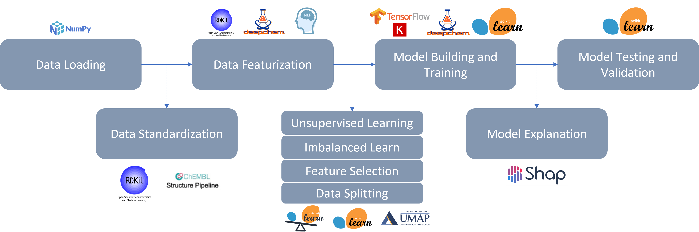

# Introduction

DeepMol is a Python-based machine and deep learning framework for drug discovery. 
It offers a variety of functionalities that enable a smoother approach to many 
drug discovery and chemoinformatics problems. It uses Tensorflow, Keras, 
Scikit-learn and DeepChem to build custom ML and DL models or 
make use of pre-built ones. It uses the RDKit framework to perform 
operations on molecular data.

Here is an image with the overall pipeline of DeepMol and the packages it uses:

