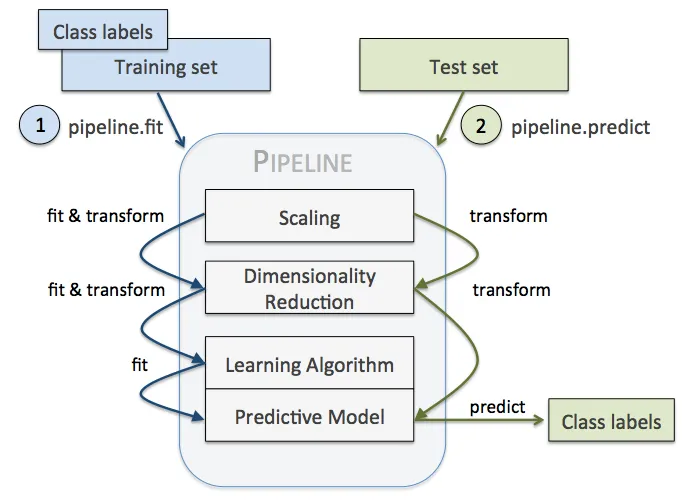
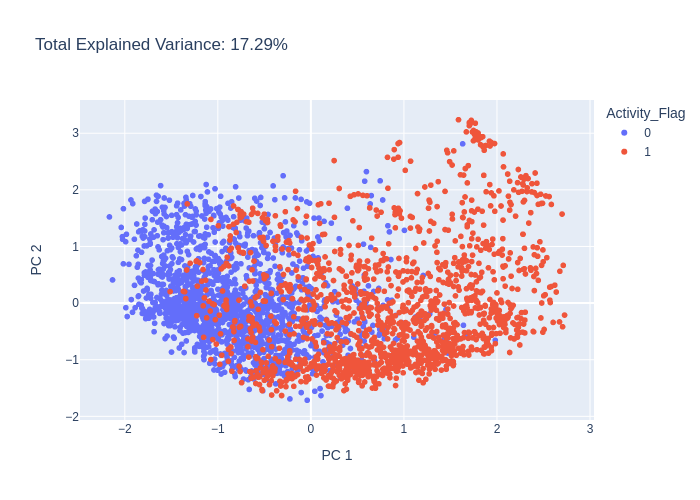

# Pipelines

In DeepMol we have implemented a pipeline class that allows to build a ML pipeline with just a few lines of code. The pipeline class is a wrapper around the sklearn pipeline class. The pipeline class allows to build a ML pipeline with the whatever steps you want to build. The steps can be any of the following:
- Feature selection
- Feature extraction
- Data Standardization
- Model

The pipelines in DeepMol work the same as Sklearn Pipelines: utilize the **fit_transform** method to fit the pipeline and transform the data. The pipeline class also allows to save the pipeline and load it again. Moreover, the pipeline class allows to evaluate the pipeline using the **evaluate** and predict method.


(source: https://towardsdatascience.com/find-thy-hyper-parameters-for-scikit-learn-pipelines-using-microsoft-nni-f1015b1224c1)

The pipeline class also allows to visualize the chemical space using the **transform** method. The **transform** method will return a dataset object with the features extracted by the pipeline. The dataset object can be used to visualize the chemical space using the **PCA** class.

In this tutorial we will show how to build a ML pipeline to predict drug activity against DRD2 receptor using DeepMol.

## Pipeline for supervised learning

We were able to build a ML pipeline to predict drug activity against DRD2 receptor using DeepMol in a few lines of code.

<font size="4"> **Let us define a pipeline to predict drug activity against DRD2 receptor** </font>

We will use the following steps:
- Basic standardization
- Morgan fingerprints
- Low variance feature selection
- Random forest model

```python
from deepmol.pipeline import Pipeline

from sklearn.ensemble import RandomForestClassifier
from deepmol.models import SklearnModel
from deepmol.feature_selection import LowVarianceFS
from deepmol.compound_featurization import MorganFingerprint
from deepmol.standardizer import BasicStandardizer

steps = [('basic standardizing', BasicStandardizer()),
         ('morgan fingerprints', MorganFingerprint(radius=2, size=1024)),
         ('low variance feature selection', LowVarianceFS(threshold=0.1)),
         ('random forest', SklearnModel(model=RandomForestClassifier(n_jobs=-1, random_state=42)))
         ]
pipeline = Pipeline(steps=steps, path="../../examples/notebooks/DRD2")
```
    2023-06-05 14:20:36,975 — INFO — Standardizer BasicStandardizer initialized with -1 jobs.


    [14:20:36] Initializing Normalizer


The steps of the pipeline have to be defined as a list of tuples. The first element of the tuple is the name of the step and the second element is the object that implements the step. The pipeline class will respect the order of the steps you defined. The path parameter is the path where the pipeline will be saved.

<font size="4"> **Let us load the data** </font>

```python
from deepmol.splitters import SingletaskStratifiedSplitter
from deepmol.loaders import CSVLoader

loader = CSVLoader(dataset_path='../data/CHEMBL217_reduced.csv',
                   smiles_field='SMILES',
                   id_field='Original_Entry_ID',
                   labels_fields=['Activity_Flag'])
data = loader.create_dataset(sep=',', header=0)
train, test = SingletaskStratifiedSplitter().train_test_split(data, fra_train=0.8, seed=42)
```

    2023-06-05 14:20:38,866 — ERROR — Molecule with smiles: ClC1=C(N2CCN(O)(CC2)=C/C=C/CNC(=O)C=3C=CC(=CC3)C4=NC=CC=C4)C=CC=C1Cl removed from dataset.
    2023-06-05 14:20:38,868 — INFO — Assuming classification since there are less than 10 unique y values. If otherwise, explicitly set the mode to 'regression'!


    [14:20:38] Explicit valence for atom # 6 N, 5, is greater than permitted

<font size="4"> **Let us fit the pipeline** </font>

### Fit
```python
pipeline.fit(train)
```


    <deepmol.pipeline.pipeline.Pipeline at 0x7f60284a2280>

### Predict
```python
y_pred = pipeline.predict(test)
```

As some pipelines identify some molecules as invalid, you can also predict including the invalid molecules:

```python
y_pred = pipeline.predict(test, return_invalid=True)
```


### Evaluate 

```python
from deepmol.metrics import Metric
from sklearn.metrics import roc_auc_score, accuracy_score, precision_score, recall_score, f1_score

pipeline.evaluate(test, metrics=[Metric(roc_auc_score), Metric(accuracy_score), Metric(precision_score), Metric(recall_score), Metric(f1_score)])
```


    ({'roc_auc_score': 0.9945097741972742,
      'accuracy_score': 0.9693601682186843,
      'precision_score': 0.9626777251184834,
      'recall_score': 0.9765625,
      'f1_score': 0.9695704057279237},
     {})


### Save and load
Now we can save it and load it again


```python
pipeline.save()
```


```python
from deepmol.pipeline import Pipeline

pipeline = Pipeline.load(path="DRD2")
```


```python
from deepmol.metrics import Metric
from sklearn.metrics import roc_auc_score, accuracy_score, precision_score, recall_score, f1_score

pipeline.evaluate(test, metrics=[Metric(roc_auc_score), Metric(accuracy_score), Metric(precision_score), Metric(recall_score), Metric(f1_score)])
```


    ({'roc_auc_score': 0.9945097741972742,
      'accuracy_score': 0.9693601682186843,
      'precision_score': 0.9626777251184834,
      'recall_score': 0.9765625,
      'f1_score': 0.9695704057279237},
     {})


## Pipeline just to visualize the chemical space


```python
from deepmol.pipeline import Pipeline
from deepmol.compound_featurization import MorganFingerprint
from deepmol.standardizer import BasicStandardizer
from deepmol.feature_selection import LowVarianceFS

steps = [('basic standardizing', BasicStandardizer()),
         ('morgan fingerprints', MorganFingerprint(radius=2, size=1024)),
         ('low variance feature selection', LowVarianceFS(threshold=0.1)),
         ]
pipeline = Pipeline(steps=steps, path="DRD2")
```

    2023-06-05 14:20:38,885 — INFO — Standardizer BasicStandardizer initialized with -1 jobs.


### Fit and transform

```python
pipeline.fit(train)
```


    <deepmol.pipeline.pipeline.Pipeline at 0x7fc8785a1940>


```python
dataset = pipeline.transform(test)
```


```python
dataset.X
```


    array([[0., 0., 0., ..., 0., 0., 0.],
           [0., 0., 0., ..., 0., 0., 0.],
           [0., 0., 0., ..., 0., 0., 0.],
           ...,
           [1., 0., 1., ..., 0., 0., 0.],
           [1., 0., 0., ..., 0., 1., 0.],
           [1., 0., 0., ..., 0., 0., 0.]], dtype=float32)


### Generate plot with PCA

```python
from deepmol.unsupervised import PCA

pca = PCA(n_components=2)
pca_df = pca.run(dataset)
pca.plot(pca_df.X)
```



## Optimize model hyperparameters in the pipeline

It is also possible to optimize the hyperparameters of the model in the pipeline. In this case we will use the pipeline to optimize the hyperparameters of a SVM model.
For that, we just have to instantiate any Hyperparameter Optimizer object and pass it to the pipeline.

Let us define a pipeline to predict drug activity against DRD2 receptor and optimize the hyperparameters of the SVM model with a Random Search and with cross-validation.


```python
from sklearn.svm import SVC
from deepmol.pipeline import Pipeline
from deepmol.compound_featurization import MorganFingerprint
from deepmol.standardizer import BasicStandardizer
from deepmol.feature_selection import LowVarianceFS
from deepmol.metrics import Metric
from sklearn.metrics import accuracy_score

steps = [('basic standardizing', BasicStandardizer()),
         ('morgan fingerprints', MorganFingerprint(radius=2, size=1024)),
         ('low variance feature selection', LowVarianceFS(threshold=0.1)),
         ]

from deepmol.parameter_optimization import HyperparameterOptimizerCV

params_dict_svc = {"C": [1.0, 1.2, 0.8], "kernel": ['linear', 'poly', 'rbf']}
optimizer = HyperparameterOptimizerCV(SVC, metric=Metric(accuracy_score),
                                          maximize_metric=True,
                                          cv=3,
                                          n_iter_search=2,
                                          params_dict=params_dict_svc,
                                          model_type="sklearn")
pipeline = Pipeline(steps=steps, path="DRD2", hpo=optimizer)
pipeline.fit(train)
```

    2023-06-29 17:50:07,118 — INFO — Standardizer BasicStandardizer initialized with -1 jobs.
    2023-06-29 17:50:12,048 — INFO — MODEL TYPE: sklearn
    2023-06-29 17:50:12,049 — INFO — Fitting 2 random models from a space of 9 possible models.
    2023-06-29 17:50:19,583 — INFO — 
     
     Best <function accuracy_score at 0x7fb358c86e50>: 0.970937 using {'kernel': 'poly', 'C': 0.8}
    2023-06-29 17:50:19,583 — INFO — 
     <function accuracy_score at 0x7fb358c86e50>: 0.970937 (0.002869) with: {'kernel': 'poly', 'C': 0.8} 
    
    2023-06-29 17:50:19,584 — INFO — 
     <function accuracy_score at 0x7fb358c86e50>: 0.939171 (0.004537) with: {'kernel': 'linear', 'C': 1.0} 
    
    2023-06-29 17:50:19,585 — INFO — Fitting best model!
    2023-06-29 17:50:21,008 — INFO — SklearnModel(mode='classification', model=SVC(C=0.8, kernel='poly'),
                 model_dir='/tmp/tmpxa4tjens')


    <deepmol.pipeline.pipeline.Pipeline at 0x7fb3c47e91c0>


```python
pipeline.hpo_all_results_
```


    {'mean_fit_time': array([0.65152605, 0.96974198]),
     'std_fit_time': array([0.04187049, 0.03145803]),
     'mean_score_time': array([0.22495739, 0.182084  ]),
     'std_score_time': array([0.00477482, 0.00655125]),
     'param_kernel': masked_array(data=['poly', 'linear'],
                  mask=[False, False],
            fill_value='?',
                 dtype=object),
     'param_C': masked_array(data=[0.8, 1.0],
                  mask=[False, False],
            fill_value='?',
                 dtype=object),
     'params': [{'kernel': 'poly', 'C': 0.8}, {'kernel': 'linear', 'C': 1.0}],
     'split0_test_score': array([0.97499437, 0.94503267]),
     'split1_test_score': array([0.96891192, 0.93849966]),
     'split2_test_score': array([0.96890491, 0.93397927]),
     'mean_test_score': array([0.97093707, 0.93917053]),
     'std_test_score': array([0.00286895, 0.0045374 ]),
     'rank_test_score': array([1, 2], dtype=int32)}


```python
pipeline.hpo_best_hyperparams_
```


    {'kernel': 'poly', 'C': 0.8}


```python
from sklearn.metrics import roc_auc_score, accuracy_score, precision_score, recall_score, f1_score
from deepmol.metrics import Metric

pipeline.evaluate(test, metrics=[Metric(roc_auc_score), Metric(accuracy_score), Metric(precision_score), Metric(recall_score), Metric(f1_score)])
```


    ({'roc_auc_score': 0.970578135100194,
      'accuracy_score': 0.9705705705705706,
      'precision_score': 0.958968347010551,
      'recall_score': 0.9831730769230769,
      'f1_score': 0.970919881305638},
     {})


Now let us try to optimize the hyperparameters of the SVM model with a validation set.


```python
from deepmol.parameter_optimization import HyperparameterOptimizerValidation
from sklearn.svm import SVC
from deepmol.pipeline import Pipeline
from deepmol.compound_featurization import MorganFingerprint
from deepmol.standardizer import BasicStandardizer
from deepmol.feature_selection import LowVarianceFS
from deepmol.metrics import Metric
from sklearn.metrics import accuracy_score

steps = [('basic standardizing', BasicStandardizer()),
         ('morgan fingerprints', MorganFingerprint(radius=2, size=1024)),
         ('low variance feature selection', LowVarianceFS(threshold=0.1)),
         ]

params_dict_svc = {"C": [1.0, 1.2, 0.8], "kernel": ['linear', 'poly', 'rbf']}
optimizer = HyperparameterOptimizerValidation(SVC, metric=Metric(accuracy_score),
                                          maximize_metric=True,
                                          cv=3,
                                          n_iter_search=2,
                                          params_dict=params_dict_svc,
                                          model_type="sklearn")
pipeline = Pipeline(steps=steps, path="DRD2", hpo=optimizer)
pipeline.fit(train, validation)
```

    2023-06-29 17:50:57,805 — INFO — Standardizer BasicStandardizer initialized with -1 jobs.
    2023-06-29 17:51:04,299 — INFO — Fitting 2 random models from a space of 9 possible models.
    2023-06-29 17:51:04,301 — INFO — Fitting model 1/2
    2023-06-29 17:51:04,301 — INFO — hyperparameters: {'C': 1.0, 'kernel': 'linear'}
    2023-06-29 17:51:06,791 — INFO — Model 1/2, Metric accuracy_score, Validation set 1: 0.937500
    2023-06-29 17:51:06,791 — INFO — 	best_validation_score so far: 0.937500
    2023-06-29 17:51:06,791 — INFO — Fitting model 2/2
    2023-06-29 17:51:06,792 — INFO — hyperparameters: {'C': 0.8, 'kernel': 'linear'}
    2023-06-29 17:51:09,036 — INFO — Model 2/2, Metric accuracy_score, Validation set 2: 0.937500
    2023-06-29 17:51:09,037 — INFO — 	best_validation_score so far: 0.937500
    2023-06-29 17:51:09,844 — INFO — Best hyperparameters: {'C': 0.8, 'kernel': 'linear'}
    2023-06-29 17:51:09,844 — INFO — train_score: 0.941950
    2023-06-29 17:51:09,845 — INFO — validation_score: 0.937500


    <deepmol.pipeline.pipeline.Pipeline at 0x7fb3cb5e01c0>


```python
pipeline.hpo_all_results_
```


    {'_C_1.000000_kernel_linear': 0.9375, '_C_0.800000_kernel_linear': 0.9375}


```python
pipeline.hpo_best_hyperparams_
```


    {'C': 0.8, 'kernel': 'linear'}


```python
from sklearn.metrics import roc_auc_score, accuracy_score, precision_score, recall_score, f1_score
from deepmol.metrics import Metric

pipeline.evaluate(test, metrics=[Metric(roc_auc_score), Metric(accuracy_score), Metric(precision_score), Metric(recall_score), Metric(f1_score)])
```


    ({'roc_auc_score': 0.9675762131775787,
      'accuracy_score': 0.9675675675675676,
      'precision_score': 0.9544392523364486,
      'recall_score': 0.9819711538461539,
      'f1_score': 0.9680094786729858},
     {})
