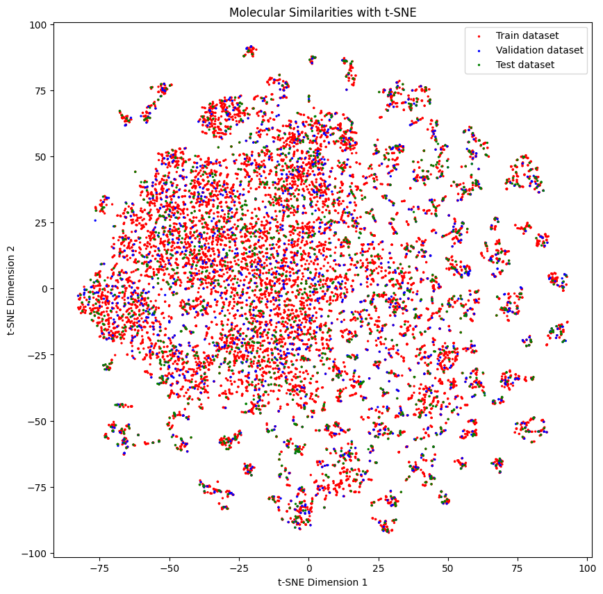
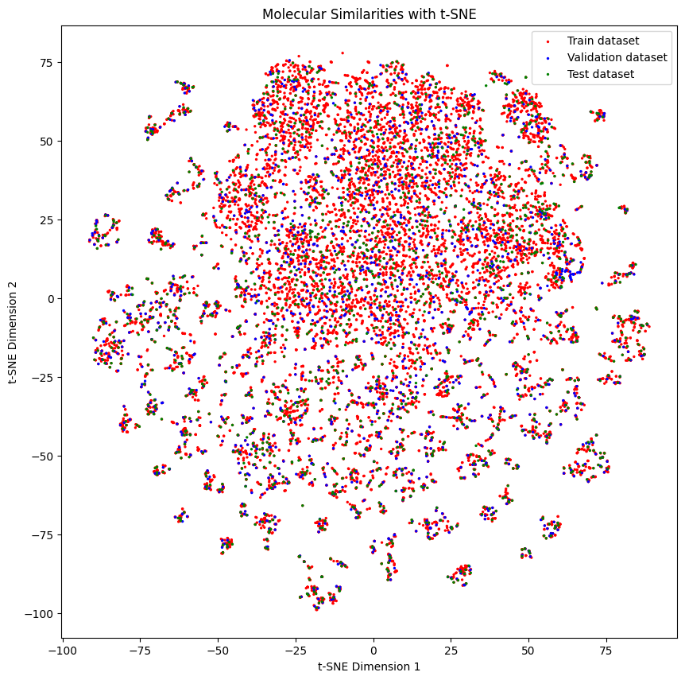
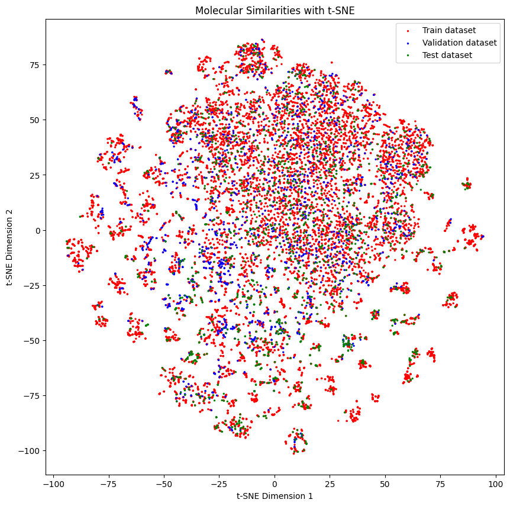
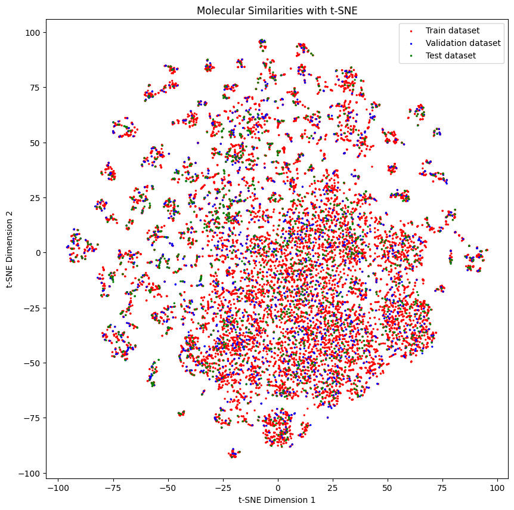
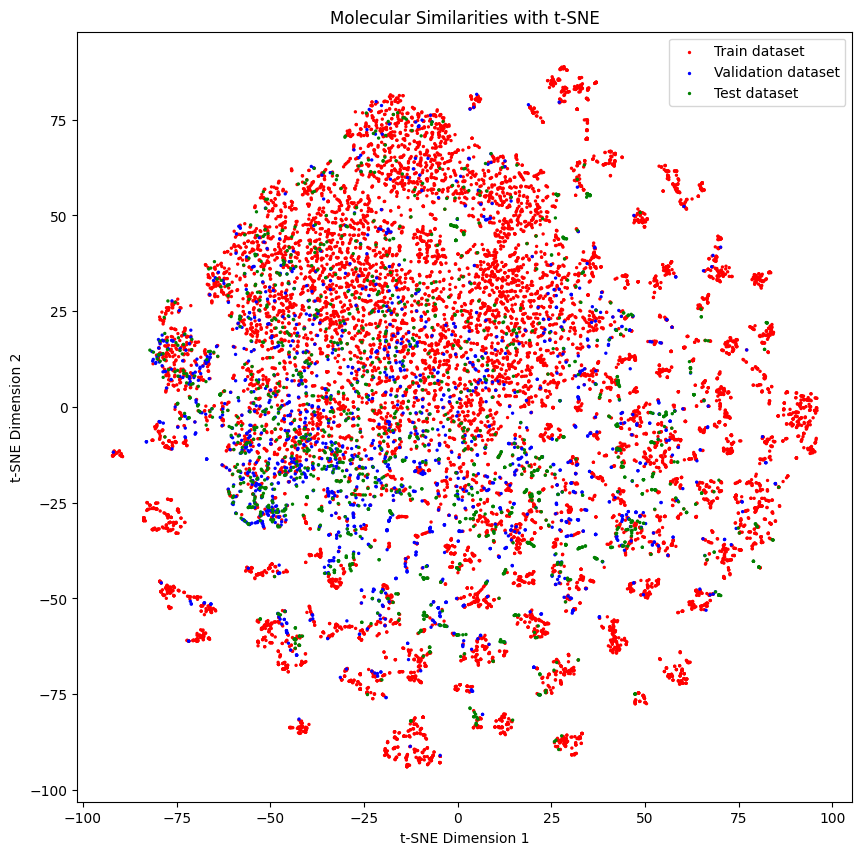
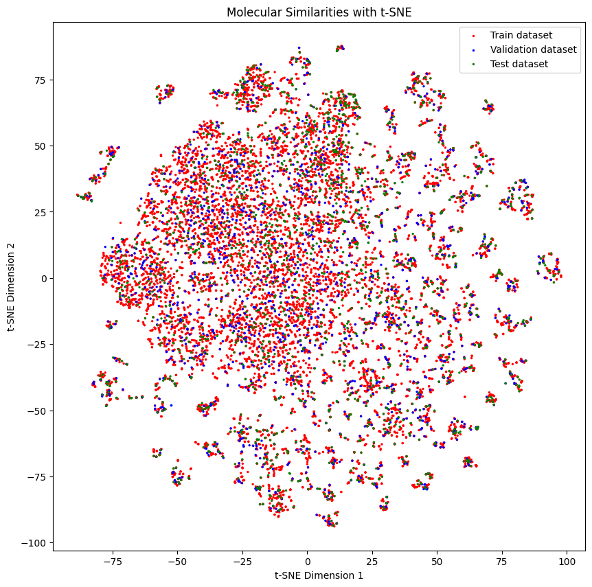

# Data splitters

Splitting your data in a Machine Learning pipeline is a crucial step. It is important to make sure that the data is split in a way that the model is not overfitting. In this tutorial we will show you how to use the splitters in DeepMol. Some splitters allow us to have an easier task for a model to learn, while others allow us to have a more difficult task for a model to learn. We will show you how to use the splitters and how to use them in a pipeline.

<font size="5"> **Create function to generate t-SNE embeddings** </font>


```python
from rdkit import Chem, DataStructs
from rdkit.Chem import AllChem
import numpy as np
from sklearn.manifold import TSNE
import matplotlib.pyplot as plt

def generate_tsne_molecular_similarities(train_dataset, valid_dataset, test_dataset):
    # Create a function to compute molecular fingerprints
    def compute_fingerprint(smiles):
        molecule = Chem.MolFromSmiles(smiles)
        fingerprint = AllChem.GetMorganFingerprintAsBitVect(molecule, 2, nBits=1024)
        return fingerprint

    # Compute molecular fingerprints for each molecule in the combined dataset
    fingerprints = [compute_fingerprint(smiles) for smiles in train_dataset.smiles]
    fingerprints.extend([compute_fingerprint(smiles) for smiles in valid_dataset.smiles])
    fingerprints.extend([compute_fingerprint(smiles) for smiles in test_dataset.smiles])

    similarity_matrix = np.zeros((len(fingerprints), len(fingerprints)))
    # Compute molecular similarities using Tanimoto coefficient
    for i in range(len(fingerprints)):
        for j in range(i + 1, len(fingerprints)):
            similarity = DataStructs.TanimotoSimilarity(fingerprints[i], fingerprints[j])
            similarity_matrix[i, j] = similarity
            similarity_matrix[j, i] = similarity

    # Apply t-SNE to reduce the dimensionality
    tsne = TSNE(n_components=2, random_state=42)
    tsne_embeddings = tsne.fit_transform(similarity_matrix)
    # Separate the embeddings based on the original datasets
    dataset1_embeddings = tsne_embeddings[:len(train_dataset.smiles)]
    dataset2_embeddings = tsne_embeddings[len(train_dataset.smiles):len(valid_dataset.smiles) + len(train_dataset.smiles)]
    dataset3_embeddings = tsne_embeddings[len(valid_dataset.smiles) + len(train_dataset.smiles):]

    # increase the size of the plot
    plt.figure(figsize=(10, 10))

    # Plot the embeddings with different colors for each dataset
    plt.scatter(dataset1_embeddings[:, 0], dataset1_embeddings[:, 1], c='red', label='Train dataset', s=[2]*len(dataset1_embeddings))
    plt.scatter(dataset2_embeddings[:, 0], dataset2_embeddings[:, 1], c='blue', label='Validation dataset', s=[2]*len(dataset2_embeddings))
    plt.scatter(dataset3_embeddings[:, 0], dataset3_embeddings[:, 1], c='green', label='Test dataset', s=[2]*len(dataset3_embeddings))
    plt.legend()
    plt.xlabel('t-SNE Dimension 1')
    plt.ylabel('t-SNE Dimension 2')
    plt.title('Molecular Similarities with t-SNE')
    plt.show()
```


```python
from deepmol.loaders import CSVLoader

dataset = CSVLoader("../data/CHEMBL217_reduced.csv", id_field="Original_Entry_ID",
                    smiles_field="SMILES", labels_fields=["Activity_Flag"]).create_dataset()
```


## SingletaskStratifiedSplitter

A single task stratified splitter splits the data into train, validation and test sets. The data is split in a way that the distribution of the labels is the same in each set. 
This is useful when we have a dataset with a large number of classes or a highly unbalanced dataset, and we want to make sure that the distribution of the classes is the same in each set.


```python
from deepmol.splitters import SingletaskStratifiedSplitter

splitter = SingletaskStratifiedSplitter()
train_dataset, valid_dataset, test_dataset = splitter.train_valid_test_split(dataset, frac_train=0.8, frac_valid=0.1, frac_test=0.1)
```

 Below we can see the distribution of the labels in each set

As you might see, the distribution of the labels is roughly the same in each set.


```python
train_dataset.get_shape()
```

    ((13316,), None, (13316,))


```python
import pandas as pd

pd.Series(train_dataset.y).value_counts()
```


    0    6658
    1    6657
    dtype: int64


```python
valid_dataset.get_shape()
```

    ((1664,), None, (1664,))


```python
import pandas as pd

pd.Series(valid_dataset.y).value_counts()
```


    1    849
    0    832
    dtype: int64


```python
test_dataset.get_shape()
```


    ((1665,), None, (1665,))


```python
import pandas as pd

pd.Series(test_dataset.y).value_counts()
```


    0    833
    1    816
    dtype: int64


<font size="5"> **Below we can see the distribution of the molecules in each set** </font>

```python
generate_tsne_molecular_similarities(train_dataset, valid_dataset, test_dataset)
```


    

    


Then you can train them with a model. Here we use a random forest classifier.


```python
from deepmol.compound_featurization import MorganFingerprint
from deepmol.models import SklearnModel
from deepmol.metrics import Metric
from sklearn.ensemble import RandomForestClassifier
from sklearn.metrics import accuracy_score

MorganFingerprint().featurize(train_dataset, inplace=True)
MorganFingerprint().featurize(valid_dataset, inplace=True)
MorganFingerprint().featurize(test_dataset, inplace=True)

rf = RandomForestClassifier()
model = SklearnModel(model=rf)
model.fit(train_dataset)
model.evaluate(test_dataset, [Metric(accuracy_score, name="accuracy")])
```


    ({'accuracy': 0.9843843843843844}, {})


```python
from deepmol.metrics import Metric

model.evaluate(valid_dataset, [Metric(accuracy_score, name="accuracy")])
```


    ({'accuracy': 0.9898869720404521}, {})


## RandomSplitter


```python
from deepmol.splitters import RandomSplitter

train_dataset, valid_dataset, test_dataset = RandomSplitter().train_valid_test_split(dataset, frac_train=0.8, frac_valid=0.1, frac_test=0.1)
```

## MultiTaskSplitter


```python
from deepmol.loaders import CSVLoader

dataset = CSVLoader("../data/tox21.csv", id_field="mol_id",
                    smiles_field="smiles", labels_fields=["NR-AR","NR-AR-LBD","NR-AhR",
                                                          "NR-Aromatase", "NR-ER", "NR-ER-LBD",
                                                          "NR-PPAR-gamma", "SR-ARE","SR-ATAD5","SR-HSE","SR-MMP","SR-p53"]).create_dataset()
```

    [18:35:38] WARNING: not removing hydrogen atom without neighbors


    2023-06-27 18:35:39,339 — INFO — Assuming multitask since y has more than one dimension. If otherwise, explicitly set the mode to 'classification' or 'regression'!


```python
from deepmol.splitters import MultiTaskStratifiedSplitter

train_dataset, test_dataset = MultiTaskStratifiedSplitter().train_test_split(dataset, frac_train=0.8)
```


```python
import numpy as np

num_ones_per_column_train_dataset = np.sum(train_dataset.y == 1, axis=0)
num_ones_per_column_test_dataset = np.sum(test_dataset.y == 1, axis=0)
total = num_ones_per_column_train_dataset + num_ones_per_column_test_dataset

print("The percentage of each task label in the training set is:", num_ones_per_column_train_dataset / total)
print("The average percentage of the tasks labels in the training set is :", np.mean(num_ones_per_column_train_dataset / total))
print()
print("The percentage of each task label in the test set is:", num_ones_per_column_test_dataset / total)
print("The average percentage of the tasks labels in the test set is :", np.mean(num_ones_per_column_test_dataset / total))
```

    The percentage of each task label in the training set is: [0.77669903 0.79746835 0.79427083 0.78333333 0.80075662 0.80857143
     0.8172043  0.79087049 0.74242424 0.7983871  0.82244009 0.79196217]
    The average percentage of the tasks labels in the training set is : 0.7936989991588942
    
    The percentage of each task label in the test set is: [0.22330097 0.20253165 0.20572917 0.21666667 0.19924338 0.19142857
     0.1827957  0.20912951 0.25757576 0.2016129  0.17755991 0.20803783]
    The average percentage of the tasks labels in the test set is : 0.20630100084110578


```python
from deepmol.splitters import RandomSplitter

train_dataset, test_dataset = RandomSplitter().train_test_split(dataset, frac_train=0.8)
```


```python
import numpy as np

num_ones_per_column_train_dataset = np.sum(train_dataset.y == 1, axis=0)
num_ones_per_column_test_dataset = np.sum(test_dataset.y == 1, axis=0)
total = num_ones_per_column_train_dataset + num_ones_per_column_test_dataset

print("The percentage of each task label in the training set is:", num_ones_per_column_train_dataset / total)
print("The average percentage of the tasks labels in the training set is :", np.mean(num_ones_per_column_train_dataset / total))
print()
print("The percentage of each task label in the test set is:", num_ones_per_column_test_dataset / total)
print("The average percentage of the tasks labels in the test set is :", np.mean(num_ones_per_column_test_dataset / total))
```

    The percentage of each task label in the training set is: [0.82200647 0.82700422 0.80729167 0.82333333 0.80075662 0.85142857
     0.82795699 0.80785563 0.83712121 0.7983871  0.81045752 0.8108747 ]
    The average percentage of the tasks labels in the training set is : 0.818706169088316
    
    The percentage of each task label in the test set is: [0.17799353 0.17299578 0.19270833 0.17666667 0.19924338 0.14857143
     0.17204301 0.19214437 0.16287879 0.2016129  0.18954248 0.1891253 ]
    The average percentage of the tasks labels in the test set is : 0.18129383091168402

As you see the MultiTaskSplitter ensures the stratification of the classes in the training and test sets, 
while the RandomSplitter does not. Although the difference is not big, the multi-task splitter is more robust and 
scalable for extremely labelled datasets

## Similarity Splitter

A similarity splitter splits the data into train, validation and test sets. The data is split in a way that the similarity between the molecules in each set is below a certain threshold. This is useful when we want to make sure that the molecules in the validation and test sets are either not too similar or similar to the molecules in the training set.

This splitter considers all the compounds with a similarity lower than the **homogenous_threshold** to be in the same set. The higher the threshold is, the more heterogeneous the split will be. 

Moreover, this method tries to ensure the stratification of classes.


```python
from deepmol.splitters import SimilaritySplitter

similarity_splitter = SimilaritySplitter()

train_dataset, valid_dataset, test_dataset = similarity_splitter.train_valid_test_split(dataset, frac_train=0.8, frac_valid=0.1, frac_test=0.1, homogenous_threshold=0.7)
```

<font size="4"> **Below we can see the distribution of the labels in each set** </font>


```python
import pandas as pd

pd.Series(train_dataset.y).value_counts()
```


    0    6678
    1    6638
    dtype: int64


```python
import pandas as pd

pd.Series(valid_dataset.y).value_counts()
```


    1    843
    0    821
    dtype: int64


```python
import pandas as pd

pd.Series(test_dataset.y).value_counts()
```


    1    841
    0    824
    dtype: int64


<font size="4"> **Below we can see the distribution of the molecules in each set - they look quite separated from each other** </font>

```python
generate_tsne_molecular_similarities(train_dataset, valid_dataset, test_dataset)
```


    

    


Then you can train them with a model. Here we use a random forest classifier. The performance is not as good as with the stratified splitter, but it is still quite good.


```python
from deepmol.compound_featurization import MorganFingerprint
from deepmol.models import SklearnModel
from deepmol.metrics import Metric
from sklearn.ensemble import RandomForestClassifier
from sklearn.metrics import accuracy_score

MorganFingerprint().featurize(train_dataset, inplace=True)
MorganFingerprint().featurize(valid_dataset, inplace=True)
MorganFingerprint().featurize(test_dataset, inplace=True)

rf = RandomForestClassifier()
model = SklearnModel(model=rf)
model.fit(train_dataset)
model.evaluate(test_dataset, [Metric(accuracy_score, name="accuracy")])
```


    ({'accuracy': 0.7899159663865546}, {})


<font size="4"> **Let's try with a lower threshold and see what happens** </font>


```python
train_dataset, valid_dataset, test_dataset = similarity_splitter.train_valid_test_split(dataset, frac_train=0.8, frac_valid=0.1, frac_test=0.1, homogenous_threshold=0.10)
```


```python
generate_tsne_molecular_similarities(train_dataset, valid_dataset, test_dataset)
```


    

    


Molecules don't look as separated as before, and of course, the performance is better than before.


```python
from deepmol.compound_featurization import MorganFingerprint
from deepmol.models import SklearnModel
from deepmol.metrics import Metric
from sklearn.ensemble import RandomForestClassifier
from sklearn.metrics import accuracy_score

MorganFingerprint().featurize(train_dataset, inplace=True)
MorganFingerprint().featurize(valid_dataset, inplace=True)
MorganFingerprint().featurize(test_dataset, inplace=True)

rf = RandomForestClassifier()
model = SklearnModel(model=rf)
model.fit(train_dataset)
model.evaluate(test_dataset, [Metric(accuracy_score, name="accuracy")])
```


    ({'accuracy': 0.9873949579831933}, {})


## Scaffold Splitter

The scaffold splitter splits the data into train, validation and test sets. The data is split in a way that the scaffolds of the molecules in each set are different or the same, depending on the **homogenous_datasets** parameter. This is useful when we want to make sure that the molecules in the validation and test sets are different or similar in terms of substructures from the molecules in the training set.

<font size="4"> **Let's see how it works and create a split with different scaffolds in each set** </font>


```python
from deepmol.splitters import ScaffoldSplitter

scaffold_splitter = ScaffoldSplitter()

train_dataset, valid_dataset, test_dataset = scaffold_splitter.train_valid_test_split(dataset, frac_train=0.8, frac_valid=0.1, frac_test=0.1, homogenous_datasets = False)
```

<font size="4"> **Below we can see the distribution of the molecules in each set** </font>

As you might see, the distribution of the molecules in each set is a bit different.


```python
generate_tsne_molecular_similarities(train_dataset, valid_dataset, test_dataset)
```


    

    

<font size="4"> **Let's see how it works when training a model** </font>


```python
from deepmol.compound_featurization import MorganFingerprint
from deepmol.models import SklearnModel
from deepmol.metrics import Metric
from sklearn.ensemble import RandomForestClassifier
from sklearn.metrics import accuracy_score

MorganFingerprint().featurize(train_dataset, inplace=True)
MorganFingerprint().featurize(valid_dataset, inplace=True)
MorganFingerprint().featurize(test_dataset, inplace=True)

rf = RandomForestClassifier()
model = SklearnModel(model=rf)
model.fit(train_dataset)
model.evaluate(test_dataset, [Metric(accuracy_score, name="accuracy")])
```


    ({'accuracy': 0.9663865546218487}, {})


<font size="4"> **Let's make things a bit easier and create a split with similar scaffolds in each set** </font>


```python
train_dataset, valid_dataset, test_dataset = scaffold_splitter.train_valid_test_split(dataset, frac_train=0.8, frac_valid=0.1, frac_test=0.1, homogenous_datasets = True)
```


```python
generate_tsne_molecular_similarities(train_dataset, valid_dataset, test_dataset)
```


    

    


```python
from deepmol.compound_featurization import MorganFingerprint
from deepmol.models import SklearnModel
from deepmol.metrics import Metric
from sklearn.ensemble import RandomForestClassifier
from sklearn.metrics import accuracy_score

MorganFingerprint().featurize(train_dataset, inplace=True)
MorganFingerprint().featurize(valid_dataset, inplace=True)
MorganFingerprint().featurize(test_dataset, inplace=True)

rf = RandomForestClassifier()
model = SklearnModel(model=rf)
model.fit(train_dataset)
model.evaluate(test_dataset, [Metric(accuracy_score, name="accuracy")])
```


    ({'accuracy': 0.9807923169267707}, {})


As you see, the performance is a bit better than before.

## Butina splitter

The Butina splitter splits the data into train, validation and test sets. The data is split in a way that the molecules in each set are different or similar according to a clustering method called Butina, depending on the **homogenous_datasets** parameter. This is useful when we want to make sure that the molecules in the validation and test sets are different or similar from the molecules in the training set.


```python
from deepmol.splitters import ButinaSplitter

butina_splitter = ButinaSplitter()

train_dataset, valid_dataset, test_dataset = butina_splitter.train_valid_test_split(dataset, frac_train=0.8, frac_valid=0.1, frac_test=0.1, homogenous_datasets = False)
```

<font size="4"> **Below we can see the distribution of the molecules in each set** </font>

As you might see, the distribution of the molecules in each set is a bit different.


```python
generate_tsne_molecular_similarities(train_dataset, valid_dataset, test_dataset)
```


    

    


```python
from deepmol.compound_featurization import MorganFingerprint
from deepmol.models import SklearnModel
from deepmol.metrics import Metric
from sklearn.ensemble import RandomForestClassifier
from sklearn.metrics import accuracy_score

MorganFingerprint().featurize(train_dataset, inplace=True)
MorganFingerprint().featurize(valid_dataset, inplace=True)
MorganFingerprint().featurize(test_dataset, inplace=True)

rf = RandomForestClassifier()
model = SklearnModel(model=rf)
model.fit(train_dataset)
model.evaluate(test_dataset, [Metric(accuracy_score, name="accuracy")])
```


    ({'accuracy': 0.9147659063625451}, {})


<font size="4"> **Let's make things a bit easier and create a split with similar molecules in each set** </font>


```python
from deepmol.splitters import ButinaSplitter

butina_splitter = ButinaSplitter()

train_dataset, valid_dataset, test_dataset = butina_splitter.train_valid_test_split(dataset, frac_train=0.8, frac_valid=0.1, frac_test=0.1, homogenous_datasets = True)
```

<font size="4"> **Below we can see the distribution of the molecules in each set** </font>


```python
generate_tsne_molecular_similarities(train_dataset, valid_dataset, test_dataset)
```


    

    


```python
from deepmol.compound_featurization import MorganFingerprint
from deepmol.models import SklearnModel
from deepmol.metrics import Metric
from sklearn.ensemble import RandomForestClassifier
from sklearn.metrics import accuracy_score

MorganFingerprint().featurize(train_dataset, inplace=True)
MorganFingerprint().featurize(valid_dataset, inplace=True)
MorganFingerprint().featurize(test_dataset, inplace=True)

rf = RandomForestClassifier()
model = SklearnModel(model=rf)
model.fit(train_dataset)
model.evaluate(test_dataset, [Metric(accuracy_score, name="accuracy")])
```


    ({'accuracy': 0.9617950272892662}, {})


As you see, the performance is a bit better than before.


