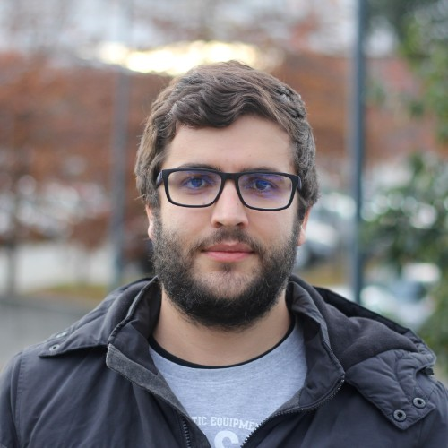
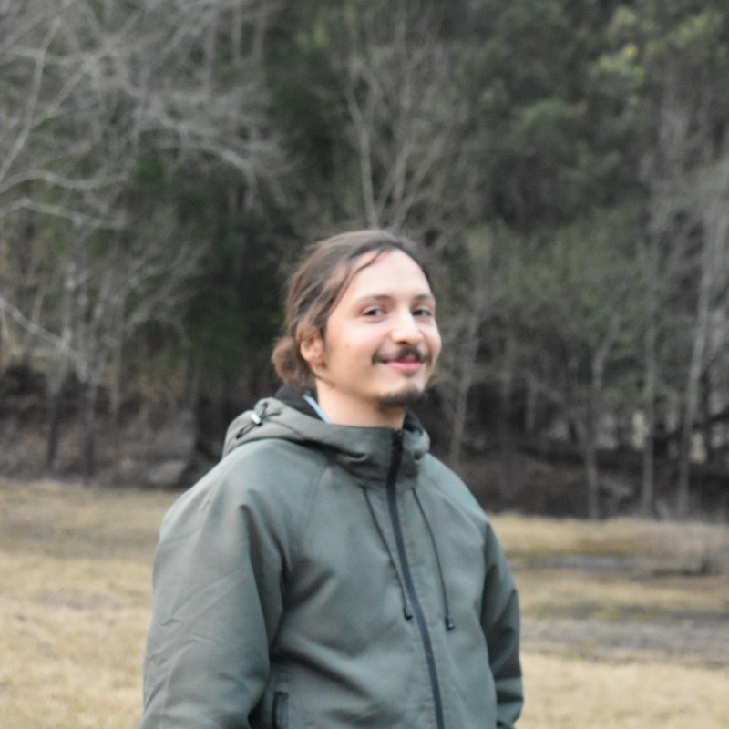
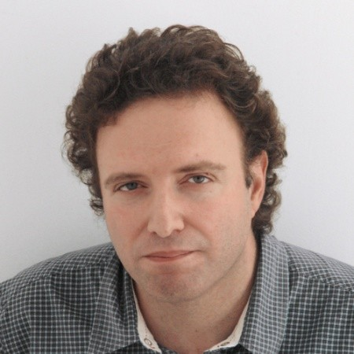

## About Us

DeepMol is managed by a team of contributors from the BioSystems group 
at the Centre of Biological Engineering, University of Minho.

This research was financed by Portuguese Funds through FCT – Fundação para 
a Ciência e a Tecnologia.

## Contributors

João Correia - PhD student at the University of Minho (UMinho) and 
researcher at the Centre of Biological Engineering (CEB), Braga, Portugal. João Correia is a PhD student in 
Bioinformatics currently working with machine learning methods applied to the discovery of new chemical compounds 
and reactions.

João Capela - PhD student at the University of Minho (UMinho) and 
researcher at the Centre of Biological Engineering (CEB), Braga, Portugal. João Capela is a 
PhD student in Bioinformatics currently working with machine learning methods to expose plant secondary metabolism.

Vitor Pereira - Postdoctoral researcher at the University of Minho (UMinho) and Centre of Biological Engineering (CEB),
Braga, Portugal. Vitor Pereira is a postdoctoral researcher in Bioinformatics currently working with machine learning
to produce new chemical compounds and proteins.

Miguel Rocha - Associate Professor in Artificial Intelligence and Bioinformatics, 
being the founder of the MSc in Bioinformatics (2007) and its current Director. 
He is currently the CSO of OmniumAI. He has 20 years of experience in applying AI and data science 
technologies to biological and biomedical data, both in academic (with numerous publications) 
and in industry scenarios.