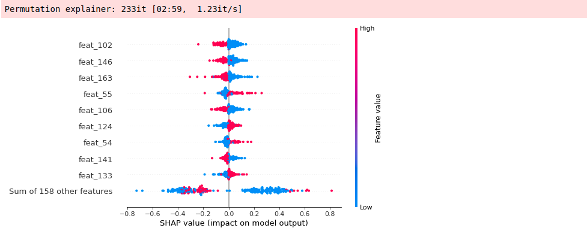
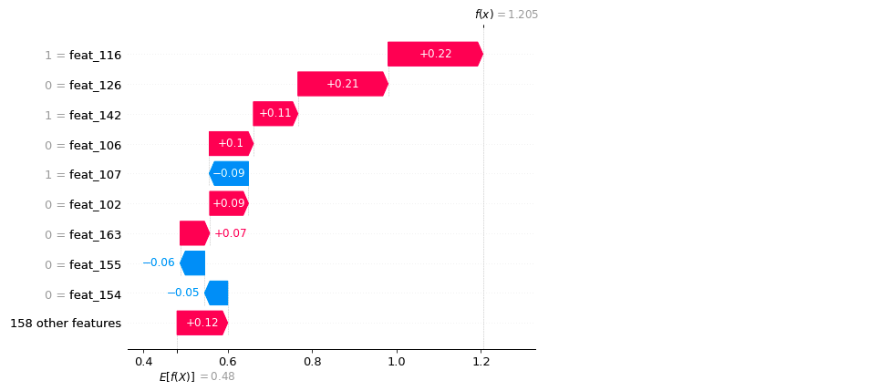
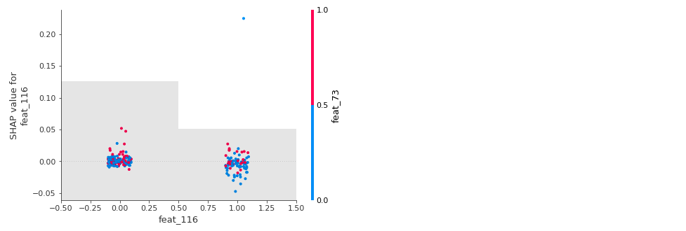

# Feature Importance (Shap Values)

Explain the output of a machine learning model can be done using SHAP (SHapley 
Additive exPlanations) package. The features that most influenced (positively or
negatively) a certain prediction can be calculated and visualized in different 
ways:

```python
from deepmol.feature_importance import ShapValues

shap_calc = ShapValues(test_dataset, model)
shap_calc.computePermutationShap()
```



```python
shap_calc.plotSampleExplanation(index=1, plot_type='waterfall')
```



```python
shap_calc.plotFeatureExplanation(index=115)
```



#### Draw relevant features

It is possible to plot the ON bits (or some of them) in a molecule for MACCS Keys,
Morgan and RDK Fingeprints. IT is also possible to draw those bits on the 
respective molecule. This can be allied with the Shap Values calculation to 
highlight the zone of the molecule that most contributed to a certain prediction,
for instance, the substructure in the molecule that most contributed to its 
classification as an active or inactive molecule against a receptor.

```python
from deepmol.utils.utils import draw_MACCS_Pattern

patt_number = 54
mol_number = 1

prediction = model.predict(test_dataset)[mol_number]
actual_value = test_dataset.y[mol_number]
print('Prediction: ', prediction)
print('Actual Value: ', actual_value)
smi = test_dataset.mols[mol_number]

draw_MACCS_Pattern(smi, patt_number)
```

