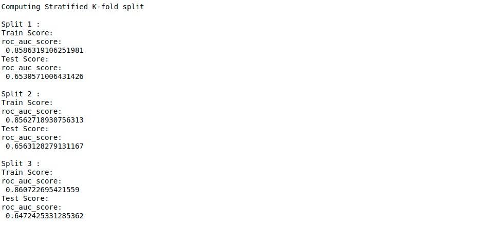
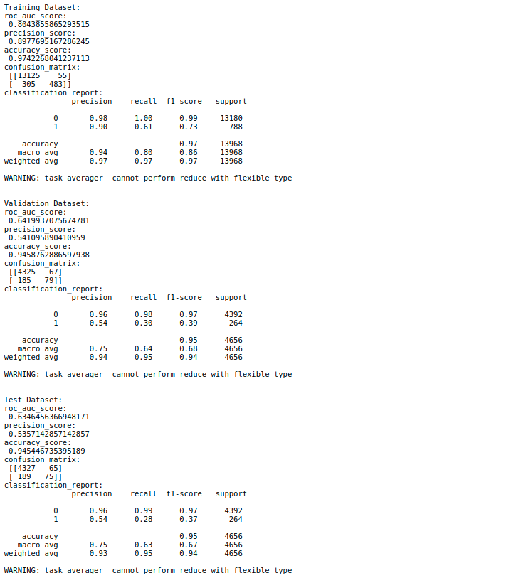

# Build, train and evaluate a model

It is possible use pre-built models from Scikit-Learn and DeepChem or build new
ones using keras layers. Wrappers for Scikit-Learn, Keras and DeepChem were 
implemented allowing evaluation of the models under a common workspace.

## Scikit-Learn model example

Models can be imported from scikit-learn and wrapped using the SKlearnModel
module.

Check this **[jupyter notebook](../../examples/notebooks/RandomForestTest.ipynb)** for a complete example!

```python
from sklearn.ensemble import RandomForestClassifier
from deepmol.models.sklearn_models import SklearnModel

# Scikit-Learn Random Forest
rf = RandomForestClassifier()
# wrapper around scikit learn models
model = SklearnModel(model=rf)
# model training
model.fit(train_dataset)

from deepmol.metrics.metrics import Metric
from deepmol.metrics.metrics_functions import roc_auc_score

# cross validate model on the full dataset
model.cross_validate(dataset, Metric(roc_auc_score), folds=3)
```



```python
from sklearn.metrics import precision_score, accuracy_score, confusion_matrix, classification_report, \ 
    roc_auc_score
from deepmol.metrics.metrics import Metric

#evaluate the model using different metrics
metrics = [Metric(roc_auc_score), Metric(precision_score), Metric(accuracy_score), Metric(confusion_matrix), 
           Metric(classification_report)]

# evaluate the model on training data
print('Training Dataset: ')
train_score = model.evaluate(train_dataset, metrics)

# evaluate the model on training data
print('Validation Dataset: ')
valid_score = model.evaluate(valid_dataset, metrics)

# evaluate the model on training data
print('Test Dataset: ')
test_score = model.evaluate(test_dataset, metrics)
```



## Keras model example

Example of how to build and wrap a keras model using the KerasModel module.

Check this **[jupyter notebook](../../examples/notebooks/test_keras.ipynb)** for a complete example!

```python
from tensorflow.keras.models import Sequential
from tensorflow.keras.layers import Dense, Dropout
from deepmol.metrics.metrics import Metric
from deepmol.metrics.metrics_functions import roc_auc_score, precision_score, accuracy_score, \
    confusion_matrix, classification_report

input_dim = train_dataset.X.shape[1]


def create_model(optimizer='adam', dropout=0.5, input_dim=input_dim):
  # create model
  model = Sequential()
  model.add(Dense(12, input_dim=input_dim, activation='relu'))
  model.add(Dropout(dropout))
  model.add(Dense(8, activation='relu'))
  model.add(Dense(1, activation='sigmoid'))
  # Compile model
  model.compile(loss='binary_crossentropy', optimizer=optimizer, metrics=['accuracy'])
  return model


from deepmol.models.keras_models import KerasModel

model = KerasModel(create_model, epochs=5, verbose=1, optimizer='adam')

# train model
model.fit(train_dataset)

# make prediction on the test dataset with the model
model.predict(test_dataset)

# evaluate model using multiple metrics
metrics = [Metric(roc_auc_score),
           Metric(precision_score),
           Metric(accuracy_score),
           Metric(confusion_matrix),
           Metric(classification_report)]

print('Training set score:', model.evaluate(train_dataset, metrics))
print('Test set score:', model.evaluate(test_dataset, metrics))
```


## DeepChem model example

Using DeepChem models:

Check this **[jupyter notebook](../../examples/notebooks/deepchem_test.ipynb)** for a complete example!

```python
from deepmol.compound_featurization import WeaveFeat
from deepchem.models import MPNNModel
from deepmol.models.deepchem_models import DeepChemModel
from deepmol.metrics.metrics import Metric
from deepmol.splitters.splitters import SingletaskStratifiedSplitter
from sklearn.metrics import roc_auc_score, precision_score, accuracy_score

ds = WeaveFeat().featurize(dataset)
splitter = SingletaskStratifiedSplitter()
train_dataset, valid_dataset, test_dataset = splitter.train_valid_test_split(dataset=ds, frac_train=0.6, frac_valid=0.2,
                                                                             frac_test=0.2)
mpnn = MPNNModel(n_tasks=1, n_pair_feat=14, n_atom_feat=75, n_hidden=75, T=1, M=1, mode='classification')
model_mpnn = DeepChemModel(mpnn)


# Model training
model_mpnn.fit(train_dataset)
valid_preds = model_mpnn.predict(valid_dataset)
test_preds = model_mpnn.predict(test_dataset)


# Evaluation
metrics = [Metric(roc_auc_score), Metric(precision_score), Metric(accuracy_score)]
print('Training Dataset: ')
train_score = model_mpnn.evaluate(train_dataset, metrics)
print('Valid Dataset: ')
valid_score = model_mpnn.evaluate(valid_dataset, metrics)
print('Test Dataset: ')
test_score = model_mpnn.evaluate(test_dataset, metrics)    
```

## Hyperparameter Optimization

Grid and randomized hyperparameter optimization is provided using cross-validation
or a held-out validation set.

```python
from deepmol.parameter_optimization.hyperparameter_optimization import HyperparameterOptimizerValidation

# Hyperparameter Optimization (using the above created keras model)
optimizer = HyperparameterOptimizerValidation(create_model)

params_dict = {'optimizer': ['adam', 'rmsprop'],
               'dropout': [0.2, 0.4, 0.5]}

best_model, best_hyperparams, all_results = optimizer.hyperparameter_search(params_dict, train_dataset,
                                                                            valid_dataset, Metric(roc_auc_score))

# Evaluate model
best_model.evaluate(test_dataset, metrics)
```