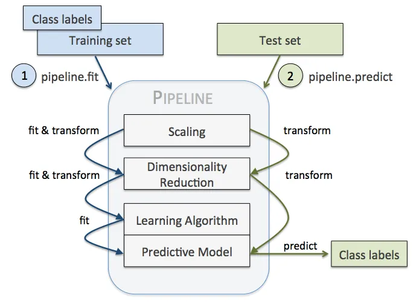
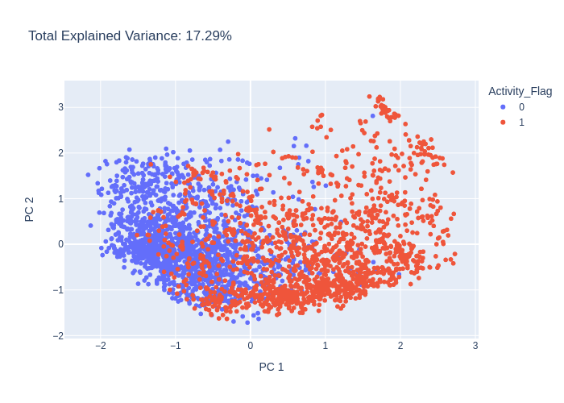

# DeepMol pipelines

In DeepMol we have implemented a pipeline class that allows to build a ML pipeline with just a few lines of code. The pipeline class is a wrapper around the sklearn pipeline class. The pipeline class allows to build a ML pipeline with the whatever steps you want to build. The steps can be any of the following:
- Feature selection
- Feature extraction
- Data Standardization
- Model

The pipelines in DeepMol work the same as Sklearn Pipelines: utilize the **fit_transform** method to fit the pipeline and transform the data. The pipeline class also allows to save the pipeline and load it again. Moreover, the pipeline class allows to evaluate the pipeline using the **evaluate** and predict method.


(source: https://towardsdatascience.com/find-thy-hyper-parameters-for-scikit-learn-pipelines-using-microsoft-nni-f1015b1224c1)

The pipeline class also allows to visualize the chemical space using the **transform** method. The **transform** method will return a dataset object with the features extracted by the pipeline. The dataset object can be used to visualize the chemical space using the **PCA** class.

In this tutorial we will show how to build a ML pipeline to predict drug activity against DRD2 receptor using DeepMol.

# Predict drug activity against DRD2 receptor using DeepMol

We were able to build a ML pipeline to predict drug activity against DRD2 receptor using DeepMol wit just 9 lines of code.

### Let us define a pipeline to predict drug activity against DRD2 receptor

We will use the following steps:
- Basic standardization
- Morgan fingerprints
- Low variance feature selection
- Random forest model


```python
from deepmol.pipeline import Pipeline

from deepmol.metrics import Metric
from sklearn.metrics import roc_auc_score, accuracy_score, precision_score, recall_score, f1_score
from sklearn.ensemble import RandomForestClassifier
from deepmol.models import SklearnModel
from deepmol.splitters import SingletaskStratifiedSplitter
from deepmol.feature_selection import LowVarianceFS
from deepmol.compound_featurization import MorganFingerprint
from deepmol.standardizer import BasicStandardizer
from deepmol.loaders import CSVLoader

steps = [('basic standardizing', BasicStandardizer()),
         ('morgan fingerprints', MorganFingerprint(radius=2, size=1024)),
         ('low variance feature selection', LowVarianceFS(threshold=0.1)),
         ('random forest', SklearnModel(model=RandomForestClassifier(n_jobs=-1, random_state=42)))
         ]
pipeline = Pipeline(steps=steps, path="DRD2")
```
    2023-06-05 14:20:36,975 — INFO — Standardizer BasicStandardizer initialized with -1 jobs.


    [14:20:36] Initializing Normalizer


The steps of the pipeline have to be defined as a list of tuples. The first element of the tuple is the name of the step and the second element is the object that implements the step. The pipeline class will respect the order of the steps you defined. The path parameter is the path where the pipeline will be saved.

### Let us load the data


```python
loader = CSVLoader(dataset_path='../data/CHEMBL217_reduced.csv',
                   smiles_field='SMILES',
                   id_field='Original_Entry_ID',
                   labels_fields=['Activity_Flag'])
data = loader.create_dataset(sep=',', header=0)
train, test = SingletaskStratifiedSplitter().train_test_split(data, fra_train=0.8, seed=42)
```

    2023-06-05 14:20:38,866 — ERROR — Molecule with smiles: ClC1=C(N2CCN(O)(CC2)=C/C=C/CNC(=O)C=3C=CC(=CC3)C4=NC=CC=C4)C=CC=C1Cl removed from dataset.
    2023-06-05 14:20:38,868 — INFO — Assuming classification since there are less than 10 unique y values. If otherwise, explicitly set the mode to 'regression'!


    [14:20:38] Explicit valence for atom # 6 N, 5, is greater than permitted


### Let us fit the pipeline


```python
pipeline.fit(train)
```


    <deepmol.pipeline.pipeline.Pipeline at 0x7f60284a2280>


### Let us evaluate the pipeline


```python
pipeline.evaluate(test, metrics=[Metric(roc_auc_score), Metric(accuracy_score), Metric(precision_score), Metric(recall_score), Metric(f1_score)])
```


    ({'roc_auc_score': 0.9945097741972742,
      'accuracy_score': 0.9693601682186843,
      'precision_score': 0.9626777251184834,
      'recall_score': 0.9765625,
      'f1_score': 0.9695704057279237},
     {})


### Now we can save it and load it again


```python
pipeline.save()
```


```python
pipeline = Pipeline.load(path="DRD2")
```


```python
pipeline.evaluate(test, metrics=[Metric(roc_auc_score), Metric(accuracy_score), Metric(precision_score), Metric(recall_score), Metric(f1_score)])
```


    ({'roc_auc_score': 0.9945097741972742,
      'accuracy_score': 0.9693601682186843,
      'precision_score': 0.9626777251184834,
      'recall_score': 0.9765625,
      'f1_score': 0.9695704057279237},
     {})


### Let us try using the pipeline just to visualize the chemical space


```python
steps = [('basic standardizing', BasicStandardizer()),
         ('morgan fingerprints', MorganFingerprint(radius=2, size=1024)),
         ('low variance feature selection', LowVarianceFS(threshold=0.1)),
         ]
pipeline = Pipeline(steps=steps, path="DRD2")
```

    2023-06-05 14:20:38,885 — INFO — Standardizer BasicStandardizer initialized with -1 jobs.


```python
pipeline.fit(train)
```


    <deepmol.pipeline.pipeline.Pipeline at 0x7fc8785a1940>


```python
dataset = pipeline.transform(test)
```


```python
dataset.X
```


    array([[0., 0., 0., ..., 0., 0., 0.],
           [0., 0., 0., ..., 0., 0., 0.],
           [0., 0., 0., ..., 0., 0., 0.],
           ...,
           [1., 0., 1., ..., 0., 0., 0.],
           [1., 0., 0., ..., 0., 1., 0.],
           [1., 0., 0., ..., 0., 0., 0.]], dtype=float32)


```python
from deepmol.unsupervised import PCA

pca = PCA(n_components=2)
pca_df = pca.run(dataset)
pca.plot(pca_df.X)
```


