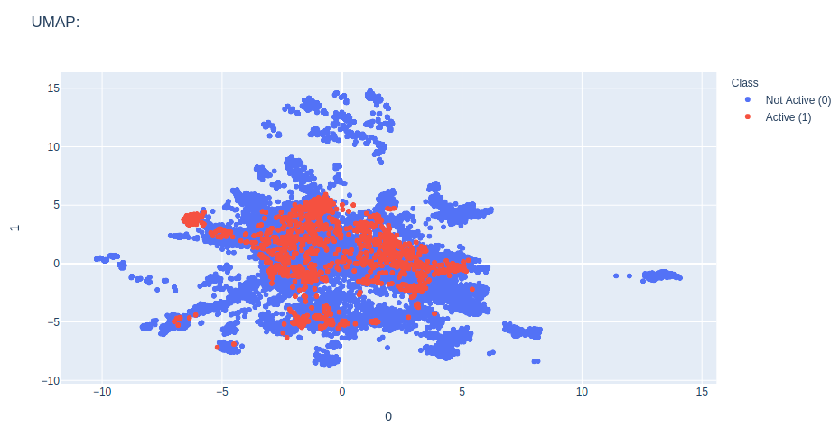

# Unsupervised Exploration

It is possible to do unsupervised exploration of the datasets using PCA, tSNE,
KMeans and UMAP.

```python
from deepmol.unsupervised import UMAP

ump = UMAP()
umap_df = ump.run_unsupervised(dataset)
ump.plot(umap_df.X, path='umap_output.png')
```

