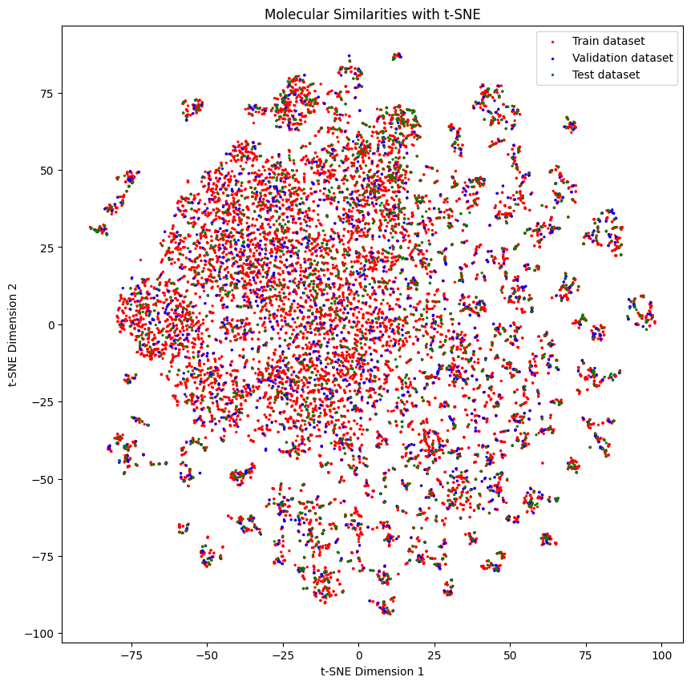

# Data splitters

Splitting your data in a Machine Learning pipeline is a crucial step. It is important to make sure that the data is split in a way that the model is not overfitting. In this tutorial we will show you how to use the splitters in DeepMol. Some splitters allow us to have an easier task for a model to learn, while others allow us to have a more difficult task for a model to learn. We will show you how to use the splitters and how to use them in a pipeline.

## Import data


```python
from deepmol.splitters import SingletaskStratifiedSplitter
from deepmol.loaders import CSVLoader
from deepmol.splitters import SimilaritySplitter

from deepmol.compound_featurization import MorganFingerprint

from deepmol.models import SklearnModel
from sklearn.ensemble import RandomForestClassifier
from sklearn.metrics import accuracy_score
from deepmol.metrics import Metric
import pandas as pd
```

### Create function to generate t-SNE embeddings


```python
import numpy as np
from rdkit import Chem, DataStructs
from rdkit.Chem import AllChem
from sklearn.manifold import TSNE
import matplotlib.pyplot as plt

def generate_tsne_molecular_similarities(train_dataset, valid_dataset, test_dataset):
    # Create a function to compute molecular fingerprints
    def compute_fingerprint(smiles):
        molecule = Chem.MolFromSmiles(smiles)
        fingerprint = AllChem.GetMorganFingerprintAsBitVect(molecule, 2, nBits=1024)
        return fingerprint

    # Compute molecular fingerprints for each molecule in the combined dataset
    fingerprints = [compute_fingerprint(smiles) for smiles in train_dataset.smiles]
    fingerprints.extend([compute_fingerprint(smiles) for smiles in valid_dataset.smiles])
    fingerprints.extend([compute_fingerprint(smiles) for smiles in test_dataset.smiles])

    similarity_matrix = np.zeros((len(fingerprints), len(fingerprints)))
    # Compute molecular similarities using Tanimoto coefficient
    for i in range(len(fingerprints)):
        for j in range(i + 1, len(fingerprints)):
            similarity = DataStructs.TanimotoSimilarity(fingerprints[i], fingerprints[j])
            similarity_matrix[i, j] = similarity
            similarity_matrix[j, i] = similarity

    # Apply t-SNE to reduce the dimensionality
    tsne = TSNE(n_components=2, random_state=42)
    tsne_embeddings = tsne.fit_transform(similarity_matrix)
    # Separate the embeddings based on the original datasets
    dataset1_embeddings = tsne_embeddings[:len(train_dataset.smiles)]
    dataset2_embeddings = tsne_embeddings[len(train_dataset.smiles):len(valid_dataset.smiles) + len(train_dataset.smiles)]
    dataset3_embeddings = tsne_embeddings[len(valid_dataset.smiles) + len(train_dataset.smiles):]

    # increase the size of the plot
    plt.figure(figsize=(10, 10))

    # Plot the embeddings with different colors for each dataset
    plt.scatter(dataset1_embeddings[:, 0], dataset1_embeddings[:, 1], c='red', label='Train dataset', s=[2]*len(dataset1_embeddings))
    plt.scatter(dataset2_embeddings[:, 0], dataset2_embeddings[:, 1], c='blue', label='Validation dataset', s=[2]*len(dataset2_embeddings))
    plt.scatter(dataset3_embeddings[:, 0], dataset3_embeddings[:, 1], c='green', label='Test dataset', s=[2]*len(dataset3_embeddings))
    plt.legend()
    plt.xlabel('t-SNE Dimension 1')
    plt.ylabel('t-SNE Dimension 2')
    plt.title('Molecular Similarities with t-SNE')
    plt.show()
```


```python
dataset = CSVLoader("../data/CHEMBL217_reduced.csv", id_field="Original_Entry_ID",
                    smiles_field="SMILES", labels_fields=["Activity_Flag"]).create_dataset()
```

    2023-05-30 19:25:58,819 — ERROR — Molecule with smiles: ClC1=C(N2CCN(O)(CC2)=C/C=C/CNC(=O)C=3C=CC(=CC3)C4=NC=CC=C4)C=CC=C1Cl removed from dataset.
    2023-05-30 19:25:58,829 — INFO — Assuming classification since there are less than 10 unique y values. If otherwise, explicitly set the mode to 'regression'!


    [19:25:58] Explicit valence for atom # 6 N, 5, is greater than permitted


# Splitters

## SingletaskStratifiedSplitter

A single task stratified splitter splits the data into train, validation and test sets. The data is split in a way that the distribution of the labels is the same in each set. This is useful when we have a dataset with a large number of classes and we want to make sure that the distribution of the classes is the same in each set.


```python
splitter = SingletaskStratifiedSplitter()
train_dataset, valid_dataset, test_dataset = splitter.train_valid_test_split(dataset, frac_train=0.8, frac_valid=0.1, frac_test=0.1)
```

### Below we can see the distribution of the labels in each set

As you might see, the distribution of the labels is roughly the same in each set.


```python
train_dataset.get_shape()
```

    2023-05-30 19:26:05,087 — INFO — Mols_shape: (13316,)
    2023-05-30 19:26:05,088 — INFO — Features_shape: None
    2023-05-30 19:26:05,090 — INFO — Labels_shape: (13316,)


    ((13316,), None, (13316,))


```python
pd.Series(train_dataset.y).value_counts()
```


    0    6658
    1    6657
    dtype: int64


```python
valid_dataset.get_shape()
```

    2023-05-30 19:26:07,727 — INFO — Mols_shape: (1664,)
    2023-05-30 19:26:07,728 — INFO — Features_shape: None
    2023-05-30 19:26:07,729 — INFO — Labels_shape: (1664,)


    ((1664,), None, (1664,))


```python
pd.Series(valid_dataset.y).value_counts()
```


    1    849
    0    832
    dtype: int64


```python
test_dataset.get_shape()
```

    2023-05-30 19:26:10,047 — INFO — Mols_shape: (1665,)
    2023-05-30 19:26:10,049 — INFO — Features_shape: None
    2023-05-30 19:26:10,050 — INFO — Labels_shape: (1665,)


    ((1665,), None, (1665,))


```python
pd.Series(test_dataset.y).value_counts()
```


    0    833
    1    816
    dtype: int64


### Below we can see the distribution of the molecules in each set


```python
generate_tsne_molecular_similarities(train_dataset, valid_dataset, test_dataset)
```


    

    


Then you can train them with a model. Here we use a random forest classifier.


```python
MorganFingerprint().featurize(train_dataset, inplace=True)
MorganFingerprint().featurize(valid_dataset, inplace=True)
MorganFingerprint().featurize(test_dataset, inplace=True)

rf = RandomForestClassifier()
model = SklearnModel(model=rf)
model.fit(train_dataset)
```


<style>#sk-container-id-1 {color: black;background-color: white;}#sk-container-id-1 pre{padding: 0;}#sk-container-id-1 div.sk-toggleable {background-color: white;}#sk-container-id-1 label.sk-toggleable__label {cursor: pointer;display: block;width: 100%;margin-bottom: 0;padding: 0.3em;box-sizing: border-box;text-align: center;}#sk-container-id-1 label.sk-toggleable__label-arrow:before {content: "▸";float: left;margin-right: 0.25em;color: #696969;}#sk-container-id-1 label.sk-toggleable__label-arrow:hover:before {color: black;}#sk-container-id-1 div.sk-estimator:hover label.sk-toggleable__label-arrow:before {color: black;}#sk-container-id-1 div.sk-toggleable__content {max-height: 0;max-width: 0;overflow: hidden;text-align: left;background-color: #f0f8ff;}#sk-container-id-1 div.sk-toggleable__content pre {margin: 0.2em;color: black;border-radius: 0.25em;background-color: #f0f8ff;}#sk-container-id-1 input.sk-toggleable__control:checked~div.sk-toggleable__content {max-height: 200px;max-width: 100%;overflow: auto;}#sk-container-id-1 input.sk-toggleable__control:checked~label.sk-toggleable__label-arrow:before {content: "▾";}#sk-container-id-1 div.sk-estimator input.sk-toggleable__control:checked~label.sk-toggleable__label {background-color: #d4ebff;}#sk-container-id-1 div.sk-label input.sk-toggleable__control:checked~label.sk-toggleable__label {background-color: #d4ebff;}#sk-container-id-1 input.sk-hidden--visually {border: 0;clip: rect(1px 1px 1px 1px);clip: rect(1px, 1px, 1px, 1px);height: 1px;margin: -1px;overflow: hidden;padding: 0;position: absolute;width: 1px;}#sk-container-id-1 div.sk-estimator {font-family: monospace;background-color: #f0f8ff;border: 1px dotted black;border-radius: 0.25em;box-sizing: border-box;margin-bottom: 0.5em;}#sk-container-id-1 div.sk-estimator:hover {background-color: #d4ebff;}#sk-container-id-1 div.sk-parallel-item::after {content: "";width: 100%;border-bottom: 1px solid gray;flex-grow: 1;}#sk-container-id-1 div.sk-label:hover label.sk-toggleable__label {background-color: #d4ebff;}#sk-container-id-1 div.sk-serial::before {content: "";position: absolute;border-left: 1px solid gray;box-sizing: border-box;top: 0;bottom: 0;left: 50%;z-index: 0;}#sk-container-id-1 div.sk-serial {display: flex;flex-direction: column;align-items: center;background-color: white;padding-right: 0.2em;padding-left: 0.2em;position: relative;}#sk-container-id-1 div.sk-item {position: relative;z-index: 1;}#sk-container-id-1 div.sk-parallel {display: flex;align-items: stretch;justify-content: center;background-color: white;position: relative;}#sk-container-id-1 div.sk-item::before, #sk-container-id-1 div.sk-parallel-item::before {content: "";position: absolute;border-left: 1px solid gray;box-sizing: border-box;top: 0;bottom: 0;left: 50%;z-index: -1;}#sk-container-id-1 div.sk-parallel-item {display: flex;flex-direction: column;z-index: 1;position: relative;background-color: white;}#sk-container-id-1 div.sk-parallel-item:first-child::after {align-self: flex-end;width: 50%;}#sk-container-id-1 div.sk-parallel-item:last-child::after {align-self: flex-start;width: 50%;}#sk-container-id-1 div.sk-parallel-item:only-child::after {width: 0;}#sk-container-id-1 div.sk-dashed-wrapped {border: 1px dashed gray;margin: 0 0.4em 0.5em 0.4em;box-sizing: border-box;padding-bottom: 0.4em;background-color: white;}#sk-container-id-1 div.sk-label label {font-family: monospace;font-weight: bold;display: inline-block;line-height: 1.2em;}#sk-container-id-1 div.sk-label-container {text-align: center;}#sk-container-id-1 div.sk-container {/* jupyter's `normalize.less` sets `[hidden] { display: none; }` but bootstrap.min.css set `[hidden] { display: none !important; }` so we also need the `!important` here to be able to override the default hidden behavior on the sphinx rendered scikit-learn.org. See: https://github.com/scikit-learn/scikit-learn/issues/21755 */display: inline-block !important;position: relative;}#sk-container-id-1 div.sk-text-repr-fallback {display: none;}</style><div id="sk-container-id-1" class="sk-top-container"><div class="sk-text-repr-fallback"><pre>RandomForestClassifier()</pre><b>In a Jupyter environment, please rerun this cell to show the HTML representation or trust the notebook. <br />On GitHub, the HTML representation is unable to render, please try loading this page with nbviewer.org.</b></div><div class="sk-container" hidden><div class="sk-item"><div class="sk-estimator sk-toggleable"><input class="sk-toggleable__control sk-hidden--visually" id="sk-estimator-id-1" type="checkbox" checked><label for="sk-estimator-id-1" class="sk-toggleable__label sk-toggleable__label-arrow">RandomForestClassifier</label><div class="sk-toggleable__content"><pre>RandomForestClassifier()</pre></div></div></div></div></div>


```python
model.evaluate(test_dataset, [Metric(accuracy_score, name="accuracy")])
```


    ({'accuracy': 0.9843843843843844}, {})


```python
model.evaluate(valid_dataset, [Metric(accuracy_score, name="accuracy")])
```


    ({'accuracy': 0.9898869720404521}, {})


## RandomSplitter


```python
from deepmol.splitters import RandomSplitter

train_dataset, valid_dataset, test_dataset = RandomSplitter().train_valid_test_split(dataset, frac_train=0.8, frac_valid=0.1, frac_test=0.1)
```

## Similarity Splitter

A similarity splitter splits the data into train, validation and test sets. The data is split in a way that the similarity between the molecules in each set is below a certain threshold. This is useful when we want to make sure that the molecules in the validation and test sets are either not too similar or similar to the molecules in the training set.

This splitter considers all the compounds with a similarity lower than the **homogenous_threshold** to be separated in the training set and test set. The higher the threshold is, the more heterogeneous the split will be.

Moreover, this method tries to ensure the stratification of classes.


```python
similarity_splitter = SimilaritySplitter()

train_dataset, valid_dataset, test_dataset = similarity_splitter.train_valid_test_split(dataset, frac_train=0.8, frac_valid=0.1, frac_test=0.1, homogenous_threshold=0.7)
```

### Below we can see the distribution of the labels in each set


```python
pd.Series(train_dataset.y).value_counts()
```


    0    6678
    1    6638
    dtype: int64


```python
pd.Series(valid_dataset.y).value_counts()
```


    1    843
    0    821
    dtype: int64


```python
pd.Series(test_dataset.y).value_counts()
```


    1    841
    0    824
    dtype: int64


### Below we can see the distribution of the molecules in each set - they look quite separated from each other


```python
generate_tsne_molecular_similarities(train_dataset, valid_dataset, test_dataset)
```


    

    


Then you can train them with a model. Here we use a random forest classifier. The performance is not as good as with the stratified splitter, but it is still quite good.


```python
MorganFingerprint().featurize(train_dataset, inplace=True)
MorganFingerprint().featurize(valid_dataset, inplace=True)
MorganFingerprint().featurize(test_dataset, inplace=True)

rf = RandomForestClassifier()
model = SklearnModel(model=rf)
model.fit(train_dataset)
model.evaluate(test_dataset, [Metric(accuracy_score, name="accuracy")])
```


    ({'accuracy': 0.7899159663865546}, {})


### Let's try with a lower threshold and see what happens


```python
train_dataset, valid_dataset, test_dataset = similarity_splitter.train_valid_test_split(dataset, frac_train=0.8, frac_valid=0.1, frac_test=0.1, homogenous_threshold=0.10)
```


```python
generate_tsne_molecular_similarities(train_dataset, valid_dataset, test_dataset)
```


    

    


Molecules don't look as separated as before, and of course, the performance is better than before.


```python
MorganFingerprint().featurize(train_dataset, inplace=True)
MorganFingerprint().featurize(valid_dataset, inplace=True)
MorganFingerprint().featurize(test_dataset, inplace=True)

rf = RandomForestClassifier()
model = SklearnModel(model=rf)
model.fit(train_dataset)
model.evaluate(test_dataset, [Metric(accuracy_score, name="accuracy")])
```


    ({'accuracy': 0.9873949579831933}, {})


## Scaffold Splitter

The scaffold splitter splits the data into train, validation and test sets. The data is split in a way that the scaffolds of the molecules in each set are different or the same, depending on the **homogenous_datasets** parameter. This is useful when we want to make sure that the molecules in the validation and test sets are different or similar in terms of substructures from the molecules in the training set.

### Let's see how it works and create a split with different scaffolds in each set


```python
from deepmol.splitters import ScaffoldSplitter

scaffold_splitter = ScaffoldSplitter()

train_dataset, valid_dataset, test_dataset = scaffold_splitter.train_valid_test_split(dataset, frac_train=0.8, frac_valid=0.1, frac_test=0.1, homogenous_datasets = False)
```

### Below we can see the distribution of the molecules in each set

As you might see, the distribution of the molecules in each set is a bit different.


```python
generate_tsne_molecular_similarities(train_dataset, valid_dataset, test_dataset)
```


    

    


### Let's see how it works when training a model


```python
MorganFingerprint().featurize(train_dataset, inplace=True)
MorganFingerprint().featurize(valid_dataset, inplace=True)
MorganFingerprint().featurize(test_dataset, inplace=True)

rf = RandomForestClassifier()
model = SklearnModel(model=rf)
model.fit(train_dataset)
model.evaluate(test_dataset, [Metric(accuracy_score, name="accuracy")])
```


    ({'accuracy': 0.9663865546218487}, {})


### Let's make things a bit easier and create a split with similar scaffolds in each set


```python
train_dataset, valid_dataset, test_dataset = scaffold_splitter.train_valid_test_split(dataset, frac_train=0.8, frac_valid=0.1, frac_test=0.1, homogenous_datasets = True)
```


```python
generate_tsne_molecular_similarities(train_dataset, valid_dataset, test_dataset)
```


    

    


```python
MorganFingerprint().featurize(train_dataset, inplace=True)
MorganFingerprint().featurize(valid_dataset, inplace=True)
MorganFingerprint().featurize(test_dataset, inplace=True)

rf = RandomForestClassifier()
model = SklearnModel(model=rf)
model.fit(train_dataset)
model.evaluate(test_dataset, [Metric(accuracy_score, name="accuracy")])
```


    ({'accuracy': 0.9807923169267707}, {})


As you see, the performance is a bit better than before.

## Butina splitter

The Butina splitter splits the data into train, validation and test sets. The data is split in a way that the molecules in each set are different or similar according to a clustering method called Butina, depending on the **homogenous_datasets** parameter. This is useful when we want to make sure that the molecules in the validation and test sets are different or similar from the molecules in the training set.


```python
from deepmol.splitters import ButinaSplitter

butina_splitter = ButinaSplitter()

train_dataset, valid_dataset, test_dataset = butina_splitter.train_valid_test_split(dataset, frac_train=0.8, frac_valid=0.1, frac_test=0.1, homogenous_datasets = False)
```

### Below we can see the distribution of the molecules in each set

As you might see, the distribution of the molecules in each set is a bit different.


```python
generate_tsne_molecular_similarities(train_dataset, valid_dataset, test_dataset)
```


    

    


```python
MorganFingerprint().featurize(train_dataset, inplace=True)
MorganFingerprint().featurize(valid_dataset, inplace=True)
MorganFingerprint().featurize(test_dataset, inplace=True)

rf = RandomForestClassifier()
model = SklearnModel(model=rf)
model.fit(train_dataset)
model.evaluate(test_dataset, [Metric(accuracy_score, name="accuracy")])
```


    ({'accuracy': 0.9147659063625451}, {})


### Let's make things a bit easier and create a split with similar molecules in each set


```python
butina_splitter = ButinaSplitter()

train_dataset, valid_dataset, test_dataset = butina_splitter.train_valid_test_split(dataset, frac_train=0.8, frac_valid=0.1, frac_test=0.1, homogenous_datasets = True)
```

### Below we can see the distribution of the molecules in each set


```python
generate_tsne_molecular_similarities(train_dataset, valid_dataset, test_dataset)
```


    

    


```python
MorganFingerprint().featurize(train_dataset, inplace=True)
MorganFingerprint().featurize(valid_dataset, inplace=True)
MorganFingerprint().featurize(test_dataset, inplace=True)

rf = RandomForestClassifier()
model = SklearnModel(model=rf)
model.fit(train_dataset)
model.evaluate(test_dataset, [Metric(accuracy_score, name="accuracy")])
```


    ({'accuracy': 0.9617950272892662}, {})


As you see, the performance is a bit better than before.


