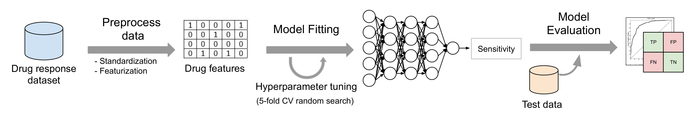
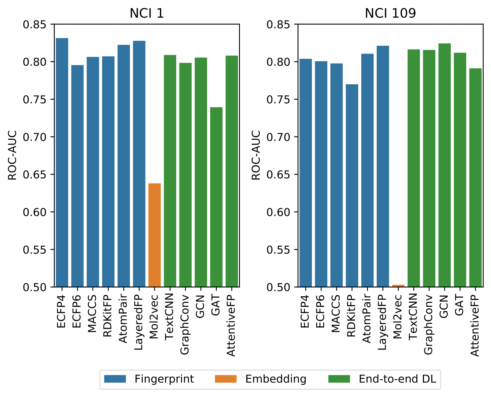
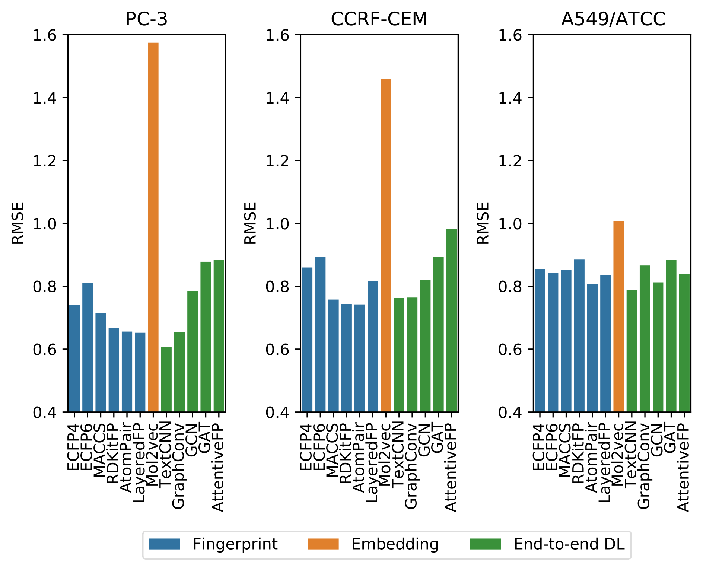

# A comparison of different compound representations for drug sensitivity prediction

This directory contains the data and scripts used in the paper "A comparison of different compound representations for
drug sensitivity prediction", submitted to the PACBB'21 conference. In this study, we used DeepMol to benchmark 12
different compound representation methods on 5 anti-cancer drug sensitivity datasets.

## Datasets
| Dataset   | Compounds | Output Variable         | Task Type      |
|-----------|-----------|-------------------------|----------------|
| NCI 1     | 3466      | sensitive/not sensitive | classification |
| NCI 109   | 3431      | sensitive/not sensitive | classification |
| PC-3      | 4294      | -log(IC<sub>50</sub>)    | regression     |
| CCRF-CEM  | 3047      | -log(IC<sub>50</sub>)    | regression     |
| A549/ATCC | 20730     | -log(GI<sub>50</sub>)    | regression     |


## Models
Fingerprints: [ECFP4](https://pubs.acs.org/doi/10.1021/ci100050t), [ECFP6](https://pubs.acs.org/doi/10.1021/ci100050t), [MACCS](https://pubs.acs.org/doi/10.1021/ci010132r), [AtomPair](https://pubs.acs.org/doi/10.1021/ci00046a002), [RDKitFP](https://www.rdkit.org/docs/RDKit_Book.html#rdkit-fingerprints), [LayeredFP](https://www.rdkit.org/docs/RDKit_Book.html#layered-fingerprints)

Embeddings: [Mol2vec](https://pubs.acs.org/doi/10.1021/acs.jcim.7b00616)

End-to-end Deep Learning Models: [TextCNN](https://arxiv.org/abs/1408.5882), [GraphConv](https://arxiv.org/abs/1509.09292), [GCN](https://arxiv.org/abs/1609.02907), [GAT](https://arxiv.org/abs/1710.10903), [AttentiveFP](https://pubs.acs.org/doi/10.1021/acs.jmedchem.9b00959)

## Modeling workflow
General data preprocessing and machine learning steps followed in this work:



## Results
The full benchmark results (with additional scoring metrics) can be found in the "results" folder.

### Classification tasks



### Regression tasks



## Reproducing the analysis
To reproduce our analysis, first build a DeepMol Docker image according to the instructions provided in the repository
README file. Then run the Docker image as a container:
```
docker run --privileged -it --rm --env KERAS_BACKEND=tensorflow deepmol bash
```

To train and evaluate a model on a dataset, run the run_models.py script. Example:
```
python run_models.py --dataset-dir data/split_datasets/PC-3 --output-filepath results.csv --model-name ECFP4 --gpu 0
```